###  **Arduino Starter Kit Numbered Checklist**

# **🔌 Core Boards & Interfaces**

**ບອດ Arduino Uno**

Arduino Uno ແມ່ນບອດພັດທະນາໄມໂຄຣຄອນໂທຣເລີທີ່ໃຊ້ກັນຢ່າງແພ່ຫຼາຍ ເຊິ່ງອີງໃສ່ຊິບ ATmega328P ທີ່ເຮັດວຽກດ້ວຍຄວາມໄວ 16 MHz. ມັນປະກອບດ້ວຍ 14 ພິນ I/O ດິຈິຕອລ, 6 ອິນພຸດອະນາລັອກ, ແລະສາມາດຮັບແຮງດັນລະຫວ່າງ 7–12V  ຜ່ານອະແດັບເຕີພາຍນອກ ຫຼື 5V ຜ່ານການເຊື່ອມຕໍ່ USB. ບອດນີ້ຮອງຮັບໂປຣໂຕຄອນການສື່ສານຫຼາຍແບບ ລວມທັງ UART, SPI, ແລະ I2C ເຊິ່ງຊ່ວຍໃຫ້ການເຊື່ອມໂຍງກັບເຊັນເຊີ, ຈໍສະແດງຜົນ ແລະຕົວຂັບເຄື່ອນໄດ້ຢ່າງງ່າຍດາຍ. ມັນຍັງມີຕົວຄວບຄຸມແຮງດັນໄຟຟ້າ ແລະຕົວແປງສັນຍານ USB-to-serial ໃນຕົວ, ເຮັດໃຫ້ມັນເໝາະສົມສຳລັບທັງຜູ້ເລີ່ມຕົ້ນ ແລະຜູ້ຊ່ຽວຊານ. Arduino IDE ຊ່ວຍໃຫ້ການຂຽນໂປຣແກຣມງ່າຍດ້ວຍໄວຍາກອນ C/C++ ແລະລະບົບຫ້ອງສະໝຸດທີ່ກວ້າງຂວາງ.

**EX:**  
- ໃນລະບົບເຮືອນແກ້ວອັດສະລິຍະ, Uno ເກັບກຳຂໍ້ມູນຈາກເຊັນເຊີ DHT11 ແລະ LDR ເພື່ອຄວບຄຸມພັດລົມ, ໄຟ ແລະການຊົນລະປະທານໂດຍອັດຕະໂນມັດ.
- ໃນລະບົບຄວາມປອດໄພ, ມັນເຊື່ອມໂຍງໂມດູນ RFID ແລະ ຣີເລເພື່ອຄວບຄຸມການເຂົ້າປະຕູ ແລະບັນທຶກການເຂົ້າອອກ.
- ໃນຫຸ່ນຍົນ, ມັນເປັນສະໝອງຂອງຫຸ່ນຍົນຕາມເສັ້ນທາງທີ່ໃຊ້ເຊັນເຊີອິນຟຣາເຣດເພື່ອກວດຫາເສັ້ນທາງ.

**ຮູບພາບປະກອບ**

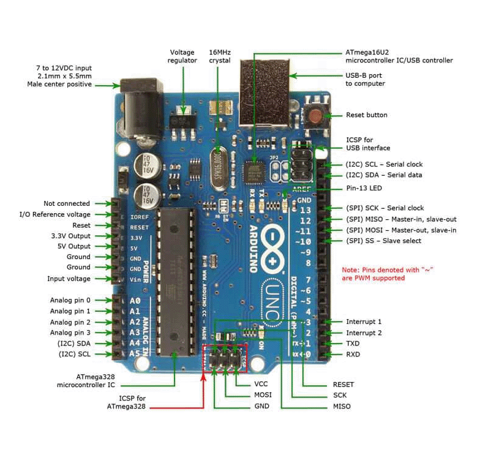

---

**ແຜ່ນທົດລອງວົງຈອນ (Breadboards)**

ແຜ່ນທົດລອງວົງຈອນແມ່ນແຜ່ນສຳລັບປະກອບວົງຈອນທີ່ບໍ່ຕ້ອງເຊື່ອມ ເຊິ່ງຊ່ວຍໃຫ້ສາມາດປະກອບ ແລະ ທົດສອບວົງຈອນໄດ້ຢ່າງໄວວາ. ແຖບໂລຫະພາຍໃນຈະສ້າງເປັນແຖວ ແລະ ຖັນທີ່ເຊື່ອມຕໍ່ກັນ, ເຮັດໃຫ້ສາມາດສອດເຂົ້າ ຫຼື ຖອດອົງປະກອບອອກໄດ້ງ່າຍດາຍ. ໂດຍປົກກະຕິແລ້ວຈະມີສອງແຖບສາຍໄຟສຳລັບ +5V ແລະ GND, ພ້ອມທັງຕາຕະລາງກາງສຳລັບວາງອົງປະກອບຕ່າງໆ. ແຜ່ນທົດລອງວົງຈອນມີປະໂຫຍດຫຼາຍສຳລັບການທົດລອງແບບຊ້ຳໆ, ສາມາດຊ່ວຍຫຼຸດຜ່ອນຄວາມສ່ຽງຕໍ່ຄວາມຜິດພາດຈາກການເຊື່ອມແບບຖາວອນ.

EX: 
- ໃນໂຄງການສະແດງອຸນຫະພູມ, ເຊັນເຊີ DHT11 ແລະ LCD ຖືກເຊື່ອມຕໍ່ກັບ Arduino ຜ່ານແຜ່ນທົດລອງວົງຈອນເພື່ອການທົດສອບທີ່ງ່າຍ.
- ໃນການສຶກສາດ້ານໄຟຟ້າ, ແຜ່ນທົດລອງວົງຈອນຊ່ວຍໃຫ້ນັກຮຽນເຫັນພາບການເຊື່ອມຕໍ່ລະຫວ່າງຕົວຕ້ານທານ, LED ແລະປຸ່ມກົດກ່ອນເຖິງການເຂື່ອມຕໍ່ຂັ້ນສຸດທ້າຍ.
- ໃນວົງຈອນຂັບເຄື່ອນມໍເຕີແບບຕົ້ນແບບ,ແຜ່ນທົດລອງວົງຈອຊ່ວຍໃຫ້ທົດສອບຊິບ L293D ໂດຍບໍ່ຕ້ອງເຊື່ອມສາຍອົງປະກອບແບບຖາວອນ. 

**ຮູບພາບປະກອບ**

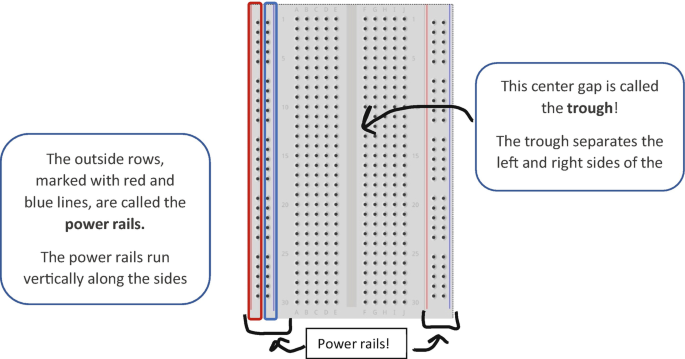

---

**ສາຍ USB**
ສາຍ USB Type-A ເປັນ Type-B ຖືກໃຊ້ເພື່ອໃຫ້ພະລັງງານ ແລະຂຽນໂປຣແກຣມໃຫ້ Arduino Uno ຈາກຄອມພິວເຕີ. ມັນສົ່ງກະແສໄຟ 5V DC ແລະຈັດການສື່ສານແບບ serial ລະຫວ່າງ Arduino ແລະ PC ຜ່ານຕົວແປງສັນຍານ ATmega16U2 ໃນຕົວ. ມັນຮອງຮັບການອັບໂຫຼດເຟີມແວ, ການເຊື່ອມຕໍ່ຜ່ານສາຍ ແລະການບັນທຶກຂໍ້ມູນແບບເວລາຈິງຜ່ານ Serial Monitor. ສາຍນີ້ຍັງຊ່ວຍໃຫ້ບອດສາມາດໃຊ້ເປັນອິນເຕີເຟດການເກັບກຳຂໍ້ມູນສຳລັບໂຄງການເຊັນເຊີຕ່າງໆ. ສາຍທີ່ມີຄຸນນະພາບສູງຮັບປະກັນການເຊື່ອມຕໍ່ທີ່ໝັ້ນຄົງ ແລະຫຼຸດຜ່ອນການຕົກຂອງແຮງດັນ.

EX: 
- ໃນລະບົບຕິດຕາມສະພາບອາກາດສົດ, ສາຍ USB ສົ່ງຂໍ້ມູນອຸນຫະພູມ ແລະຄວາມຊຸ່ມແບບເວລາຈິງໄປຫາແຜງຄວບຄຸມຄອມພິວເຕີ.
- ໃນການເຊື່ອມຕໍ່ກັບເຟີມແວ, ນັກພັດທະນາໃຊ້ສາຍເພື່ອອັບໂຫລດ sketches ແລະແກ້ໄຂບັນຫາຜ່ານ Arduino Serial Monitor.
- ໃນການຝຶກອົບຮົມໃນຫ້ອງຮຽນ, ສາຍ USB ເຊື່ອມຕໍ່ Arduino ຫຼາຍໂຕເຂົ້າກັບຄອມພິວເຕີສຳລັບການຝຶກຂຽນໂປຣແກຣມຂອງນັກຮຽນ.

**ຮູບພາບປະກອບ**

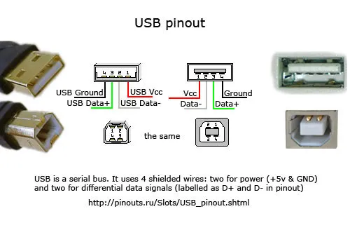

________________________________________________________________________
# **🧵 Wiring & Connectors**

**ສາຍຈັ້ມເປີ (Male-to-Male, Male-to-Female, Female-to-Female)**

ສາຍເຊື່ອມຕໍ່ແມ່ນສາຍນຳໄຟທີ່ມີສະນວນຫຸ້ມທີ່ຍືດຫຍຸ່ນ ໃຊ້ສຳລັບການເຊື່ອມຕໍ່ໄຟຟ້າຊົ່ວຄາວໃນວົງຈອນຕົ້ນແບບ. ມັນມີຫຼາຍປະເພດຂອງຫົວຕໍ່: ຫົວຜູ້ຕໍ່ຫົວຜູ້ (male-to-male) ສຳລັບເຊື່ອມຕໍ່ແຜ່ນທົດລອງເຂົ້າກັນ, ຫົວຜູ້ຕໍ່ຫົວແມ່ (male-to-female) ສຳລັບການເຊື່ອມຕໍ່ກັບໂມດູນ, ແລະ ຫົວແມ່ຕໍ່ຫົວແມ່ (female-to-female) ສຳລັບການເຊື່ອມຕໍ່ພິນຫົວ. ແກນທອງແດງ ຫຼື ທອງແດງເຄືອບຕະກົ່ວພາຍໃນຮັບປະກັນການນຳໄຟທີ່ໝັ້ນຄົງ ແລະ ຄວາມຕ້ານທານຕໍ່າ. ສາຍເຊື່ອມຕໍ່ຮອງຮັບການສົ່ງສັນຍານທັງດິຈິຕອນ ແລະ ອະນາລັອກ ແລະ ສາມາດນຳມາໃຊ້ຄືນໄດ້, ເຮັດໃຫ້ມັນເໝາະສົມສຳລັບການອອກແບບວົງຈອນແບບທົດລອງຊ້ຳໆ. ການໃຊ້ລະຫັດສີທີ່ຖືກຕ້ອງ (ເຊັ່ນ: ສີແດງສຳລັບ VCC, ສີດຳສຳລັບ GND) ຊ່ວຍຮັກສາຄວາມຊັດເຈນໃນລະບົບສາຍໄຟທີ່ສັບສົນ.

EX: 
- ໃນໂຄງການວັດໄລຍະດ້ວຍອູນຕຣາໂຊນິກ, ສາຍຈັ້ມເປີ male-to-female ເຊື່ອມຕໍ່ພິນຂອງເຊັນເຊີເຂົ້າກັບ I/O ດິຈິຕອນຂອງ Arduino.
- ໃນວົງຈອນຄວບຄຸມມໍເຕີ, ສາຍ female-to-female ເຊື່ອມຕໍ່ເອົາພຸດຂອງຕົວຂັບມໍເຕີເຂົ້າກັບພິນອິນພຸດຂອງມໍເຕີເຊີໂວ.
- ໃນຊຸດເຊັນເຊີ, ສາຍ male-to-male ຫຼາຍເສັ້ນຊ່ວຍຈັດການເຊື່ອມຕໍ່ເຟຣມເຊັນສຳລັບເຊັນເຊີອຸນຫະພູມ, ສຽງ ແລະແສງສະຫວ່າງ.

**ຮູບພາບປະກອບ**

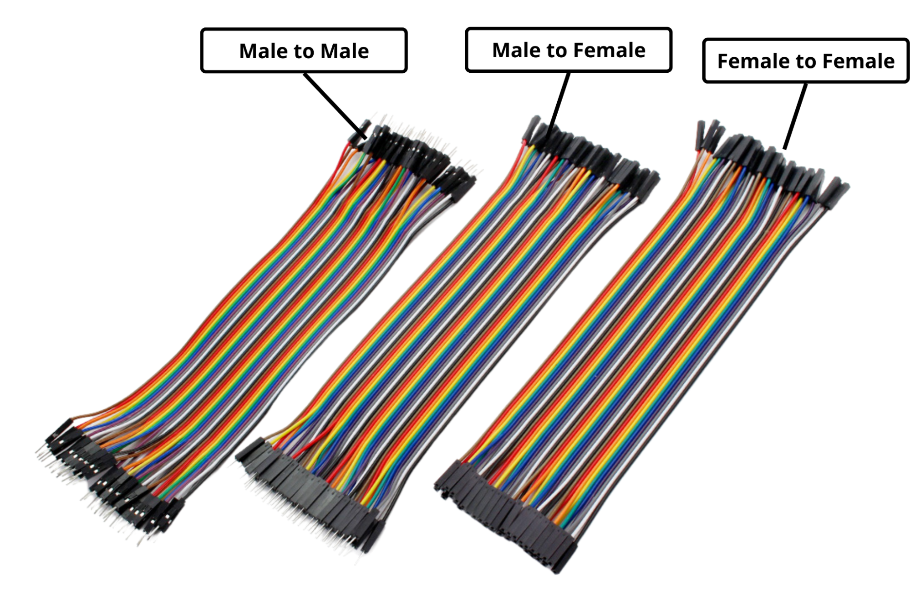

---

**Jumper wires (male-to-male)**

**ຮູບພາບປະກອບ**

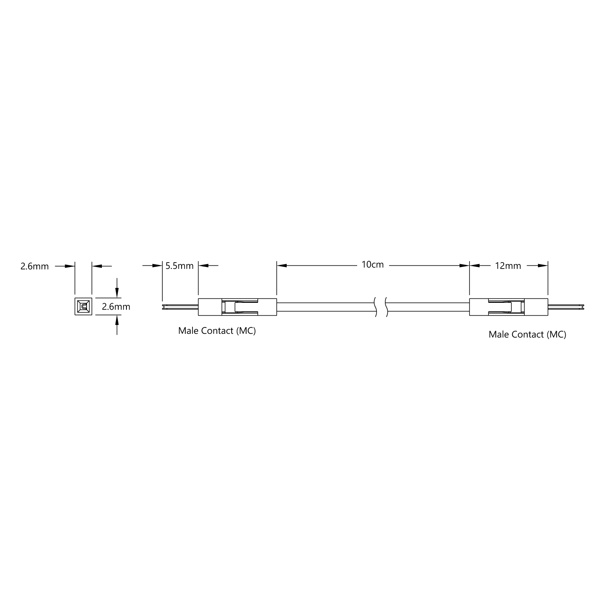

---

**Jumper wires (male-to-female)**

**ຮູບພາບປະກອບ**

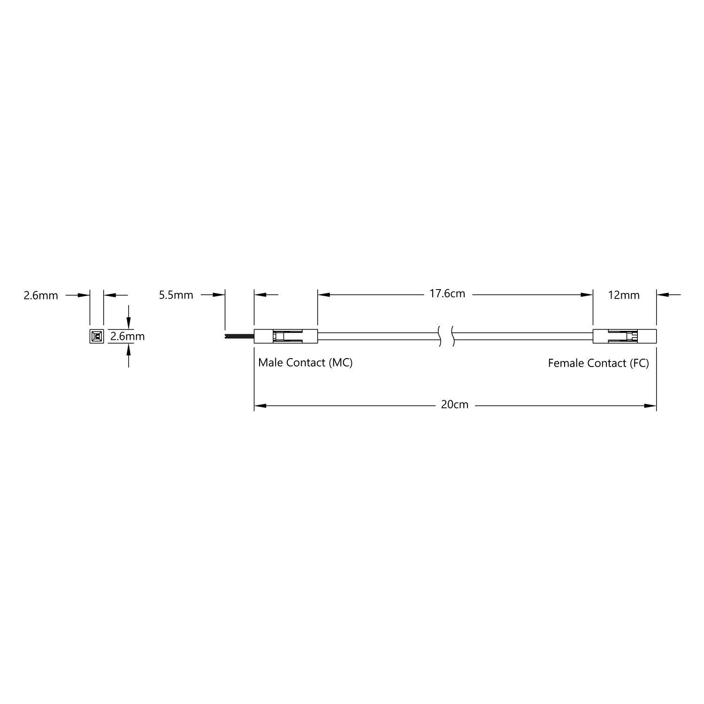

---

**Jumper wires (female-to-female)**

**ຮູບພາບປະກອບ**

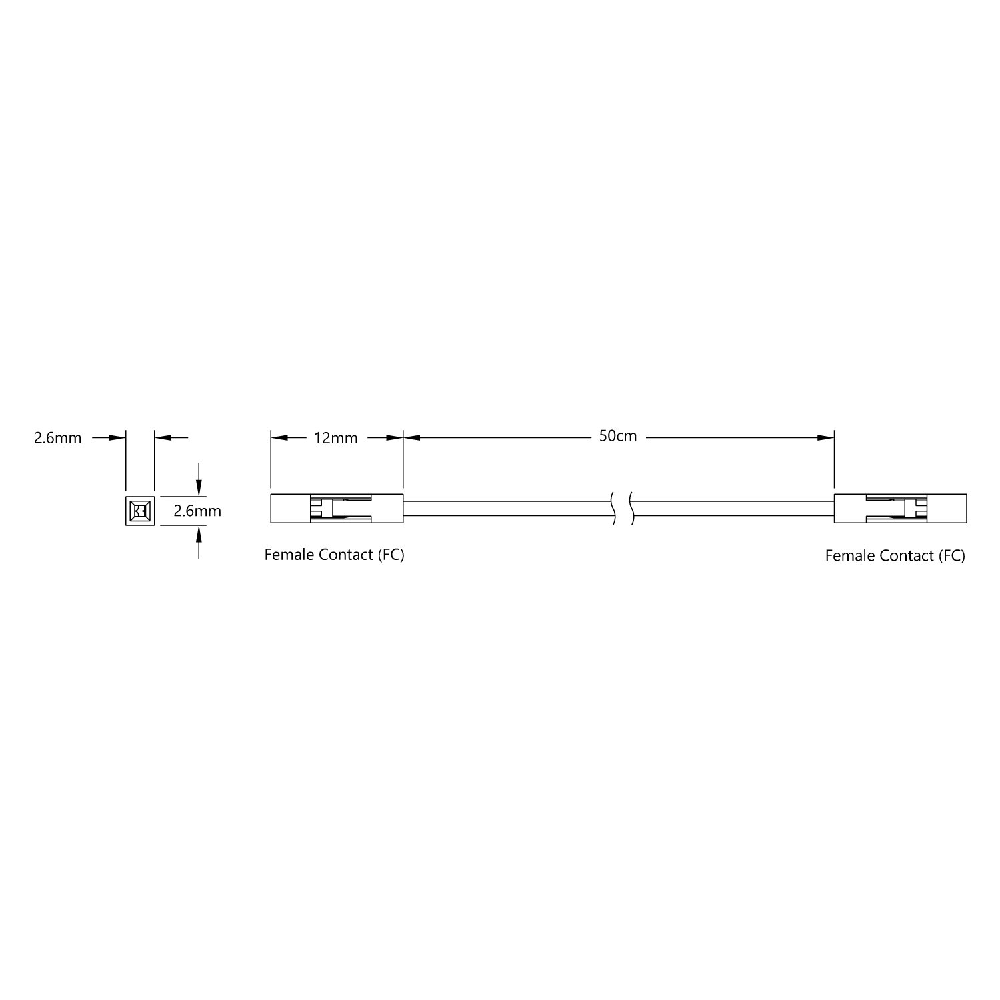

---

**ຕົວເຊື່ອມຕໍ່ແບັດເຕີຣີ 9V**

ຕົວເຊື່ອມຕໍ່ແບັດເຕີຣີ 9V ຊ່ວຍໃຫ້ມີແຫຼ່ງພະລັງງານແບບພົກພາສຳລັບ Arduino Uno ເມື່ອບໍ່ມີພະລັງງານ USB. ມັນປະກອບດ້ວຍຝາປິດແບບຕິດດ້ວຍສາຍສີແດງ (ບວກ) ແລະສີດຳ (ລົບ) ທີ່ເຊື່ອມຕໍ່ກັບປ່ອງຕໍ່ DC barrel jack ຫຼືພິນ Vin ຂອງ Arduino. ຕົວຄວບຄຸມແຮງດັນໃນຕົວຈະຫຼຸດ 9V ລົງເປັນ 5V ແລະ 3.3V, ສະໜອງລະດັບພະລັງງານທີ່ປອດໄພສຳລັບເຊັນເຊີ ແລະໂມດູນສ່ວນໃຫຍ່. ມັນສຳຄັນຫຼາຍທີ່ຕ້ອງຮັກສາຂົ້ວທີ່ຖືກຕ້ອງເພື່ອປ້ອງກັນຄວາມເສຍຫາຍຕໍ່ອົງປະກອບ. ແບັດເຕີຣີ 9V ເໝາະສົມສຳລັບການໃຊ້ງານໄລຍະສັ້ນ ຫຼືແບບເຄື່ອນທີ່, ເຊັ່ນ: ການບັນທຶກຂໍ້ມູນກາງແຈ້ງ ຫຼືຕົ້ນແບບແບບພົກພາ.

EX:
- ໃນເຊັນເຊີສິ່ງແວດລ້ອມແບບພົກພາ, ແບັດເຕີຣີ 9V ໃຫ້ພະລັງງານແກ່ Arduino ແລະເຊັນເຊີເພື່ອເກັບກຳຂໍ້ມູນຄຸນນະພາບອາກາດໃນພື້ນທີ່ຫ່າງໄກສອກຫຼີກ.
- ສຳລັບຫຸ່ນຍົນຕາມເສັ້ນ, ຕົວເຊື່ອມຕໍ່แບັດເຕີຣີສະໜອງພະລັງງານແບບເຄື່ອນທີ່, ເຮັດໃຫ້ລະບົບສາມາດເຮັດວຽກໄດ້ໂດຍບໍ່ຕ້ອງອີງໃສ່ຄອມພິວເຕີ.
- ໃນຊຸດຕອບໂຕ້ໄພພິບັດ, ພະລັງງານ 9V ຮັກສາໂມດູນການສື່ສານໃຫ້ເຮັດວຽກເມື່ອແຫຼ່ງພະລັງງານອື່ນໆລົ້ມເຫຼວ.

**ຮູບພາບປະກອບ**

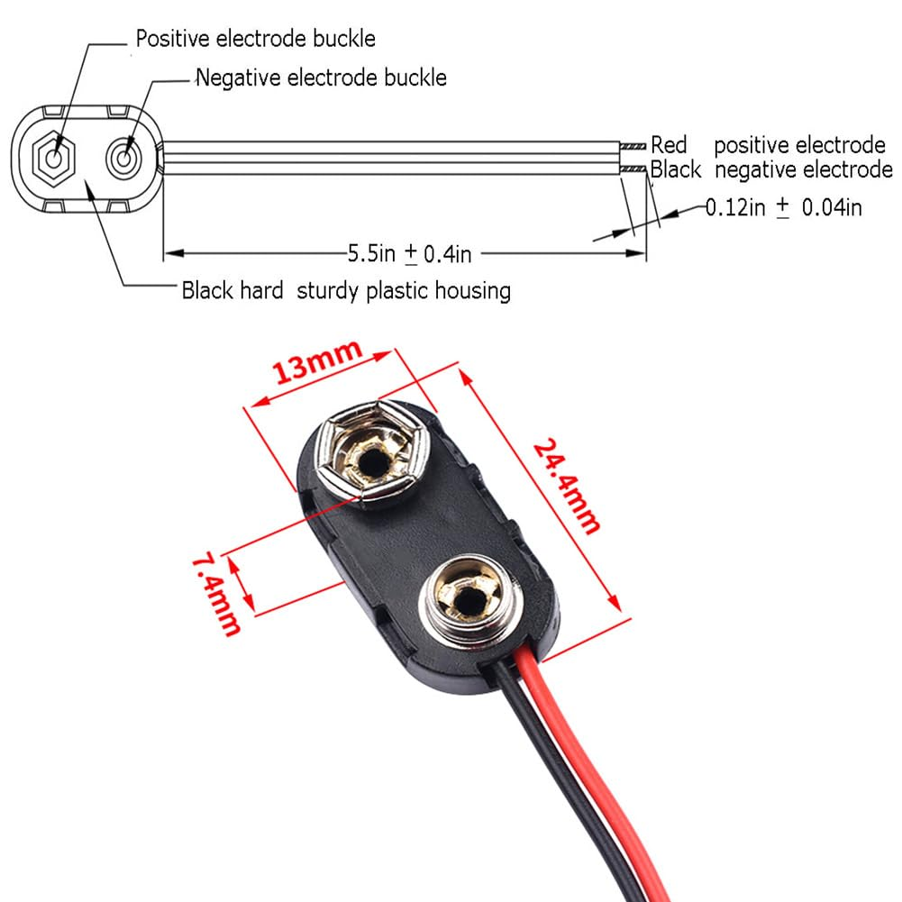

________________________________________________________________________
# **💡 Basic Components**

**ໄຟ LED (ສີແດງ, ເຫຼືອງ, ຟ້າ, RGB)**

LED (Light Emitting Diodes) ແມ່ນອຸປະກອນເຊມິຄອນດັກເຕີທີ່ປ່ອຍແສງສະຫວ່າງເມື່ອກະແສໄຟຟ້າໄຫຼຜ່ານຈາກແອນໂນດໄປຫາແຄໂທດ. ມັນໃຊ້ພະລັງງານຕ່ຳ, ມີອາຍຸການໃຊ້ງານຍາວນານ, ແລະ ມີລະຫັດສີຕາມວັດສະດຸທີ່ໃຊ້. LED ແຕ່ລະອັນຕ້ອງການຕົວຕ້ານທານຈຳກັດກະແສ (ປົກກະຕິ 220Ω) ເພື່ອປ້ອງກັນການເສຍຫາຍ. RGB LED ລວມສາມສີ (ແດງ, ຂຽວ, ຟ້າ) ໃນຫຸ້ມຫໍ່ດຽວ ແລະ ສາມາດສ້າງສີຕ່າງໆໄດ້ໂດຍໃຊ້ການຄວບຄຸມ PWM. LED ຖືກນຳໃຊ້ໃນເກືອບທຸກໂປຣແກຣມເອເລັກໂທຣນິກສຳລັບຕົວບອກສະຖານະ ແລະ ຈໍສະແດງຜົນ.

EX: 
- ໃນລະບົບສະຖານະ, LED ສີຕ່າງໆຊີ້ບອກສະຖານະເຊັນເຊີ — ສີແດງສຳລັບອັນຕະລາຍ, ສີຂຽວສຳລັບປົກກະຕິ, ສີຟ້າສຳລັບພ້ອມໃຊ້ງານ
- ໃນ dashboard IoT, RGB LED ສະແດງພາບຄວາມແຮງຂອງການເຊື່ອມຕໍ່ ຫຼື ກິດຈະກຳ Wi-Fi
- ໃນໂຄມໄຟທີ່ຕອບສະໜອງກັບສຽງ, LED ກະພິບຫຼືປ່ຽນສີຕາມລະດັບສຽງຈາກໄມໂຄຣໂຟນ

**ຮູບພາບປະກອບ**

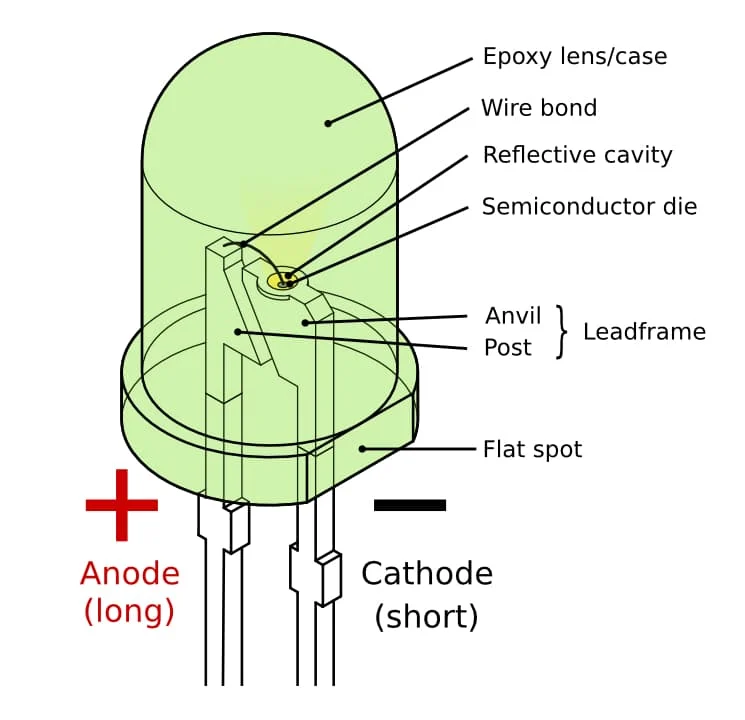

---

**ໂມດູນ RGB**

ໂມດູນ RGB ລວມເອົາ LED ສາມໂຕ (ແດງ, ຂຽວ, ຟ້າ) ເຂົ້າໃນຫຸ້ມຫໍ່ດຽວທີ່ຄວບຄຸມໄດ້ງ່າຍ. ມັນຮອງຮັບການຕັ້ງຄ່າແບບ common anode ຫຼື cathode ແລະສາມາດສ້າງສີໄດ້ເຖິງ 16 ລ້ານສີໂດຍໃຊ້ PWM (Pulse Width Modulation). ໂມດູນມັກມີຕົວຕ້ານທານ ແລະ pin ເຊື່ອມຕໍ່ທີ່ງ່າຍຕິດຢູ່ໃນຕົວ. ມັນຖືກນຳໃຊ້ຢ່າງກວ້າງຂວາງສຳລັບຕົວບອກສະຖານະແບບເບິ່ງເຫັນ, ລະບົບແສງສະຫວ່າງ, ແລະໂຄງການສິລະປະ. Arduino ສາມາດຄວບຄຸມແຕ່ລະຊ່ອງສີຜ່ານທາງ analog output pins ເພື່ອປັບຄວາມສະຫວ່າງ ແລະ ໂທນສີ.

EX: 
- ໃຊ້ໃນລະບົບແສງສະຫວ່າງແວດລ້ອມທີ່ປັບສີຂອງຫ້ອງຕາມອຸນຫະພູມ ຫຼື ສຽງ
- ໃນການຕົບແຕ່ງເຮືອນອັດສະລິຍະ, ໂມດູນ RGB ໃຫ້ແສງສະຫວ່າງທີ່ມີລະຫັດສີທີ່ຄວບຄຸມຜ່ານແອັບສະມາດໂຟນ
- ໃນລະບົບແຈ້ງເຕືອນ, ສີຕ່າງໆສະແດງການແຈ້ງເຕືອນອີເມວ ຫຼື ຂໍ້ຄວາມ

**ຮູບພາບປະກອບ**

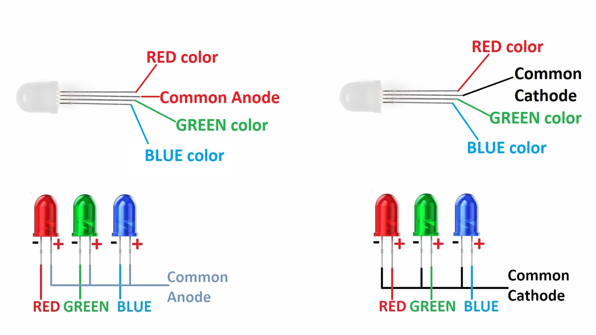

---

**ຕົວຕ້ານທານ (220Ω, 1kΩ, 10kΩ)**

ຕົວຕ້ານທານແມ່ນອຸປະກອນແບບ passive ທີ່ຄວບຄຸມການໄຫຼຂອງກະແສຕາມກົດຫມາຍໂອມ (V = IR). ຕົວຕ້ານທານ 220Ω ປົກກະຕິໃຊ້ເພື່ອປົກປ້ອງ LED, ໃນຂະນະທີ່ຄ່າ 1kΩ ແລະ 10kΩ ຖືກໃຊ້ສຳລັບ voltage dividers ແລະ ວົງຈອນ pull-up/down. ຕົວຕ້ານທານຊ່ວຍຈັດການກະແສ, ປ້ອງກັນການໂຫຼດເກີນ, ແລະຮັບປະກັນການອ່ານເຊັນເຊີທີ່ສະຖຽນ. ພວກມັນຍັງຫຼຸດສຽງລົບກວນໃນວົງຈອນແອນາລັອກ ແລະ ມີຄວາມສຳຄັນໃນການນຳໃຊ້ການກຳນົດເວລາທີ່ແນ່ນອນ. ຄ່າຂອງຕົວຕ້ານທານແຕ່ລະຕົວຖືກກຳນົດໂດຍໃຊ້ແຖບສີຕາມລະຫັດສີຂອງຕົວຕ້ານທານ.

EX: 
- ໃນວົງຈອນປຸ່ມກົດ, ຕົວຕ້ານທານ 10kΩ ເຮັດໜ້າທີ່ເປັນ pull-down ເພື່ອປ້ອງກັນ input ທີ່ລອຍ
- ໃນການຕັ້ງຄ່າ photoresistor (LDR), ຕົວຕ້ານທານ 10kΩ ສ້າງ voltage dividers ເພື່ອວັດຄວາມສະຫວ່າງ
- ໃນ input ຂອງ motor driver, ຕົວຕ້ານທານຮັບປະກັນວ່າສັນຍານຄວບຄຸມຢູ່ພາຍໃນຂອບເຂດກະແສທີ່ປອດໄພ

**ຮູບພາບປະກອບ**

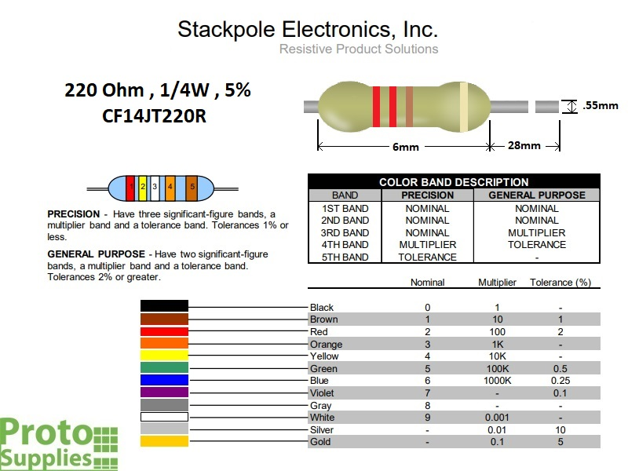

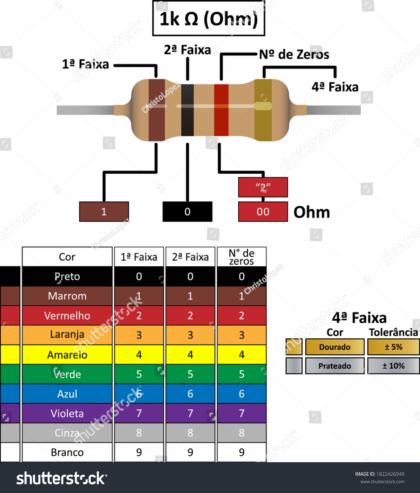

---

**ປຸ່ມກົດ (4 ອັນພ້ອມຝາ)**

ປຸ່ມກົດແມ່ນສະວິດຊົ່ວຄາວທີ່ອະນຸຍາດໃຫ້ຜູ້ໃຊ້ປ້ອນຂໍ້ມູນໂດຍການເຊື່ອມຕໍ່ຫຼືຕັດການເຊື່ອມຕໍ່ວົງຈອນ. ເມື່ອກົດ, ມັນສ້າງເສັ້ນທາງໄຟຟ້າ, ສົ່ງສັນຍານດິຈິຕອລ HIGH ຫຼື LOW ໄປຫາ Arduino. ມັນປົກກະຕິຖືກໃຊ້ກັບຕົວຕ້ານທານ 10kΩ pull-down ເພື່ອຫຼີກລ່ຽງສັນຍານລອຍ. ປຸ່ມກົດສາມາດກະຕຸ້ນການກະທຳເຊັ່ນ: ການຣີເຊັດ, ການປ່ຽນໂໝດ, ຫຼືການເລີ່ມ/ຢຸດມໍເຕີ. ພວກມັນມີຄວາມໜ້າເຊື່ອຖື, ລາຄາຖືກ, ແລະຈຳເປັນໃນລະບົບແບບໂຕ້ຕອບ.

EX: 
- ໃນລະບົບນຳທາງເມນູ, ປຸ່ມກົດສະຫຼັບລະຫວ່າງໂໝດການສະແດງຜົນຕ່າງໆຢູ່ໃນ LCD
- ໃຊ້ໃນການຄວບຄຸມຫຸ່ນຍົນ, ປຸ່ມນຶ່ງເປີດມໍເຕີໃນຂະນະທີ່ອີກປຸ່ມນຶ່ງຢຸດມັນ
- ໃນລະບົບລັອກຄວາມປອດໄພ, ປຸ່ມກົດອະນຸຍາດໃຫ້ຜູ້ໃຊ້ປ້ອນລຳດັບລະຫັດຜ່ານໂດຍໃຊ້ keypad ຂອງ Arduino

**ຮູບພາບປະກອບ**

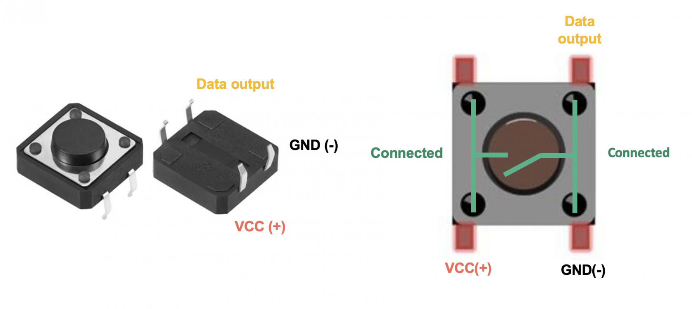

---

**ໂພເທນຊີໂອມິເຕີ (5kΩ)**

ໂພເທນຊີໂອມິເຕີແມ່ນຕົວຕ້ານທານທີ່ປ່ຽນແປງໄດ້ທີ່ມີສາມ terminal: ສອງປາຍຄົງທີ່ ແລະນຶ່ງປາຍເຄື່ອນຍ້າຍໄດ້ (wiper). ການໝຸນປຸ່ມຈະປ່ຽນແປງຄວາມຕ້ານທານ, ປັບແຕ່ງ output ຂອງແຮງດັນລະຫວ່າງປາຍ. ມັນຖືກໃຊ້ເພື່ອຄວບຄຸມ input ແບບແອນາລັອກເຊັ່ນ: ຄວາມສະຫວ່າງ, ສຽງ, ຫຼືຄວາມໄວ. Arduino ອ່ານ output ຂອງມັນຜ່ານທາງ analog pins (A0–A5) ສຳລັບການຄວບຄຸມແບບເວລາຈິງ. ໂພເທນຊີໂອມິເຕີຍັງສາມາດເຮັດໜ້າທີ່ເປັນເຄື່ອງມືປັບຄາລິເບຣດສຳລັບເຊັນເຊີ.

EX:
- ໃນ LED dimmers, ໂພເທນຊີໂອມິເຕີປັບລະດັບຄວາມສະຫວ່າງຜ່ານສັນຍານ PWM
- ໃນຕົວຄວບຄຸມຄວາມໄວມໍເຕີ, ມັນປັບປ່ຽນຄວາມໄວການໝຸນໂດຍອີງຕາມ analog input
- ໃນໂຄງການຄວບຄຸມ servo, ມັນກຳນົດມຸມຂອງ servo ຕາມການໝຸນຂອງປຸ່ມ

**ຮູບພາບປະກອບ**

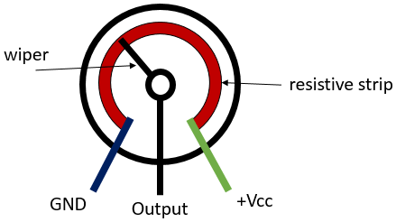

---

**ເຄື່ອງສ້າງສຽງ (Buzzers) ແບບ Active ແລະ Passive**

Buzzer ແບບ active ມີຕົວສັ່ນພາຍໃນ ແລະສ້າງສຽງເມື່ອໄດ້ຮັບພະລັງງານ DC ໂດຍກົງ. Buzzer ແບບ passive ຕ້ອງການສັນຍານພາຍນອກ (ເຊັ່ນ: PWM) ເພື່ອສ້າງສຽງ. ທັງສອງປ່ຽນສັນຍານໄຟຟ້າເປັນຄວາມຖີ່ສຽງ, ເປັນປະໂຫຍດສຳລັບສັນຍານເຕືອນຫຼືການແຈ້ງເຕືອນ. Buzzer ແບບ active ງ່າຍກວ່າ, ໃນຂະນະທີ່ແບບ passive ສາມາດກໍານົດສຽງທີ່ປັບແຕ່ງໄດ້ຜ່ານການຂຽນໂປຣແກຣມ. ພວກມັນເຮັດວຽກລະຫວ່າງ 3V–5V, ເໝາະສົມສຳລັບການເຊື່ອມຕໍ່ກັບ Arduino ໂດຍກົງ.

EX:
- ໃນສັນຍານເຕືອນປະຕູ, buzzer ແບບ active ແຈ້ງເຕືອນເມື່ອເຊັນເຊີ PIR ກວດພົບການເຄື່ອນໄຫວ
- ໃນໂຄງການດົນຕີ Arduino, buzzer ແບບ passive ຫຼິ້ນໂນດຫຼືທຳນອງໂດຍຜ່ານການປ່ຽນແປງຄວາມຖີ່
- ໃນລະບົບເຕືອນອຸນຫະພູມ, buzzer ເປີດໃຊ້ງານເມື່ອການອ່ານຄ່າເກີນກຳນົດ

**ຮູບພາບປະກອບ**

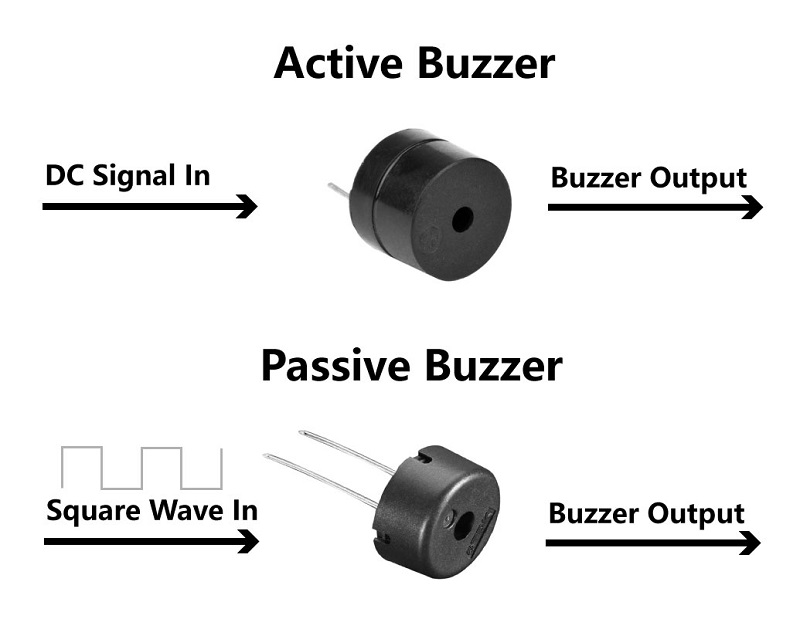

**Active Buzzer and Passive Buzzer**

**ຮູບພາບປະກອບແບບ PINOUT**

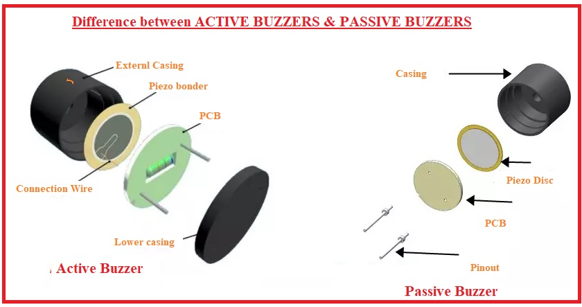
________________________________________________________________________
# **📟 Displays & Output**

**ຈໍ LCD 16x2**

LCD 16x2 ແມ່ນໂມດູນສະແດງອັກສອນທີ່ສະແດງໄດ້ເຖິງ 32 ຕົວອັກສອນ (16 ຕົວຕໍ່ແຖວ). ມັນເຮັດວຽກໂດຍໃຊ້ຕົວຄວບຄຸມ HD44780, ເຂົ້າກັນໄດ້ກັບ library LiquidCrystal ຂອງ Arduino. ຈໍສະແດງຕ້ອງການການສື່ສານແບບ parallel 4 ຫຼື 8-bit ແລະການປັບຄວາມກົງກັນຂ້າມຜ່ານໂພເທນຊີໂອມິເຕີ. ມັນເຮັດວຽກທີ່ 5V ແລະສະແດງຂໍ້ຄວາມ, ສັນຍາລັກ, ແລະຂໍ້ມູນຕົວເລກຈາກເຊັນເຊີຫຼືໂປຣແກຣມ.

EX: 
- ໃນສະຖານີອາກາດ, ມັນສະແດງການອ່ານອຸນຫະພູມ ແລະ ຄວາມຊຸ່ມຈາກເຊັນເຊີ DHT11
- ໃນລະບົບຄວາມປອດໄພ, ມັນສະແດງ user ID ຫຼື ສະຖານະການເຂົ້າເຖິງຜ່ານ RFID inputs
- ໃນໂມງ, ມັນສະແດງການອັບເດດເວລາຈິງຈາກໂມດູນ RTC

**ຮູບພາບປະກອບ**

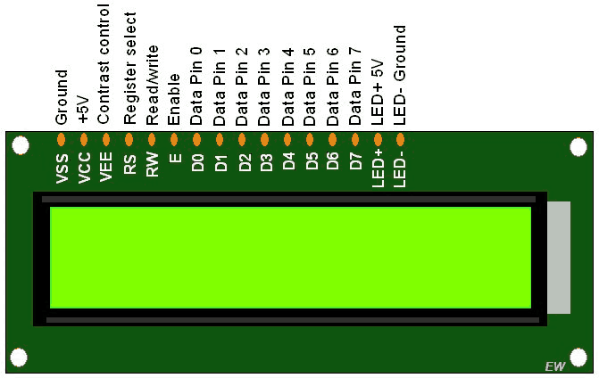

---

 **I2C Serial Adapter board module**

ໂມດູນນີ້ເຮັດໃຫ້ການຕໍ່ສາຍ LCD ງ່າຍຂຶ້ນໂດຍການຫຼຸດການເຊື່ອມຕໍ່ parallel 16 ເສັ້ນໃຫ້ເຫຼືອພຽງ 4 ເສັ້ນ (VCC, GND, SDA, SCL) ໂດຍໃຊ້ protocol I2C. ມັນປະກອບມີຊິບ PCF8574 I/O expander, ອະນຸຍາດໃຫ້ມີການໂອນຂໍ້ມູນແບບ serial-to-parallel. ອະແດັບເຕີປະຢັດ pin ຂອງ Arduino ສຳລັບເຊັນເຊີອື່ນໆ ແລະຮັບປະກັນການຕໍ່ສາຍທີ່ສະອາດກວ່າ. ມັນຮອງຮັບທີ່ຢູ່ຫຼາຍແບບ, ເຮັດໃຫ້ LCD ຫຼາຍໂຕສາມາດເຮັດວຽກພ້ອມກັນໄດ້.

EX: 
- ໃຊ້ໃນ dashboard ທີ່ມີຫຼາຍຈໍເພື່ອເຊື່ອມຕໍ່ LCD ຫຼາຍໂຕສຳລັບຂໍ້ມູນເຊັນເຊີທີ່ແຕກຕ່າງກັນ
- ໃນແຜງຄວບຄຸມຂະໜາດກະທັດຮັດ, ອະແດັບເຕີອະນຸຍາດໃຫ້ມີການຕໍ່ສາຍນ້ອຍທີ່ສຸດລະຫວ່າງ LCD ແລະ Arduino
- ໃນລະບົບທີ່ໃຊ້ແບັດເຕີຣີ, ມັນຫຼຸດການໃຊ້ພະລັງງານ ແລະ pin ເພື່ອການເຮັດວຽກທີ່ມີປະສິດທິພາບ

**ຮູບພາບປະກອບ**

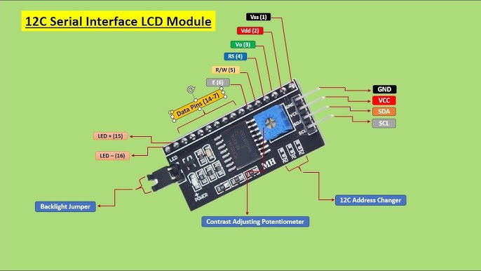

---

 **ຈໍສະແດງ 7-Segment (Common Cathode +)**

ຈໍສະແດງ 7-segment ສະແດງຕົວເລກ 0-9 ໂດຍໃຊ້ LED ເຈັດໂຕທີ່ຈັດວາງເປັນຮູບແບບສະເພາະ. ໃນປະເພດ common cathode, cathode ທັງໝົດເຊື່ອມຕໍ່ກັບ ground, ແລະແຕ່ລະ segment ໄດ້ຮັບພະລັງງານຜ່ານ Arduino. ແຕ່ລະ segment ຖືກຄວບຄຸມຜ່ານ digital pins ຫຼື shift register ເພື່ອຫຼຸດການໃຊ້ pin. ມັນເໝາະສົມສຳລັບຂໍ້ມູນຕົວເລກງ່າຍໆເຊັ່ນ: ຕົວຈັບເວລາ ຫຼື ຕົວນັບ.

EX: 
- ໃນໂມງດິຈິຕອລ, ມັນສະແດງຊົ່ວໂມງ, ນາທີ, ແລະວິນາທີ
- ໃນຕົວນັບເຫດການ, ມັນເພີ່ມຕົວເລກເມື່ອເຊັນເຊີກວດພົບການເຄື່ອນໄຫວ
- ໃນຈໍສະແດງອຸນຫະພູມ, ມັນສະແດງການອ່ານຄ່າຈາກເຊັນເຊີເຊັ່ນ LM35

**ຮູບພາບປະກອບ**

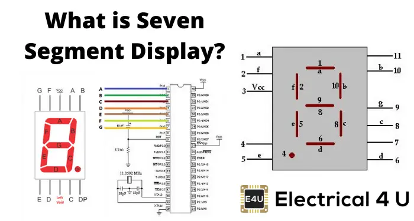

---

**ຈໍສະແດງ 7-Segment ແບບ 4 ຫຼັກ**

ໂມດູນນີ້ລວມຈໍສະແດງ 7-segment ສີ່ຫຼັກເພື່ອສະແດງຕົວເລກຫຼາຍຫຼັກ ຫຼື ເວລາ. ມັນມັກຈະໃຊ້ IC ຄວບຄຸມ TM1637 ຫຼື MAX7219 ສຳລັບການຄວບຄຸມແບບ serial. Arduino ສື່ສານກັບມັນຜ່ານ 2 ຫາ 3 pins, ຫຼຸດຄວາມຊັບຊ້ອນ. ມັນຖືກໃຊ້ໃນໂມງດິຈິຕອລ, ຕົວຈັບເວລາ, ແລະ ຕົວວັດຄວາມໄວ.

EX: 
- ໃນໂຄງການຈັບເວລາ, ມັນນັບຊ່ວງເວລາຢ່າງແນ່ນອນ
- ໃນຕົວຕິດຕາມແຮງດັນ, ມັນສະແດງແຮງດັນເວລາຈິງຈາກເຊັນເຊີແອນາລັອກ
- ໃນຕົວຈັບເວລາ IoT, ມັນສະແດງການນັບຖອຍຫຼັງສຳລັບລະບົບອັດຕະໂນມັດ

**ຮູບພາບປະກອບ**

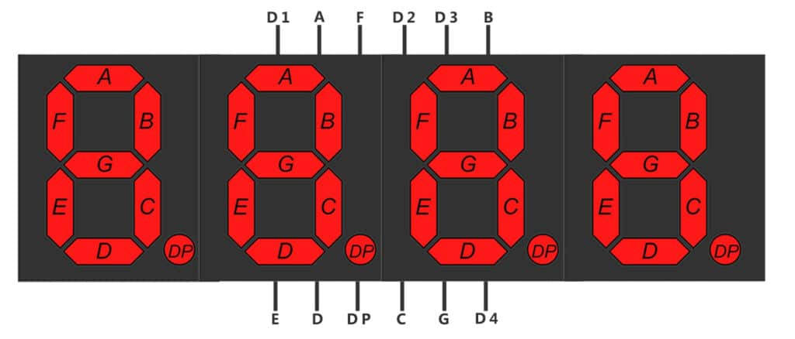

---
**ຈໍສະແດງ Dot Matrix 8x8**

LED matrix 8x8 ມີ LED 64 ໂຕທີ່ຈັດວາງເປັນແຖວ ແລະ ຖັນ, ຄວບຄຸມຜ່ານວິທີການສະແກນ ຫຼື IC ຄວບຄຸມ MAX7219. ມັນສາມາດສະແດງຕົວອັກສອນ, ຕົວເລກ, ແລະ ພາບເຄື່ອນໄຫວພື້ນຖານ. Arduino ສົ່ງຂໍ້ມູນແບບ serial ເພື່ອເປີດ LED ສະເພາະຕາມຮູບແບບທີ່ຕັ້ງໂປຣແກຣມໄວ້. ມັນຖືກນຳໃຊ້ທົ່ວໄປໃນປ້າຍດິຈິຕອລ ແລະ ການສະແດງສັນຍາລັກ.

EX: 
- ໃນຕົວບອກເກມ, ມັນສະແດງສັນຍາລັກຊີວິດ ຫຼື ຄະແນນ
- ໃນຕົວສ້າງພາບເຄື່ອນໄຫວຂະໜາດນ້ອຍ, ມັນສະແດງຮູບຮ່າງ ແລະ ເອັບເຟັກ
- ໃນບອດຂໍ້ຄວາມເລື່ອນ, ມັນສະແດງຂໍ້ຄວາມທີ່ກຳນົດເອງ

**ຮູບພາບປະກອບ**

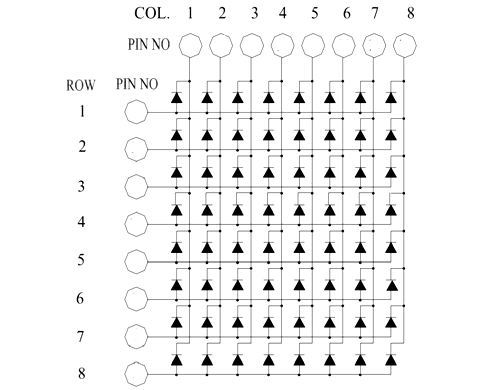

________________________________________________________________________
#### 📡 Sensors & Input Modules

**ເຊັນເຊີວັດອຸນຫະພູມ ແລະ ຄວາມຊຸ່ມ DHT11**

DHT11 ແມ່ນເຊັນເຊີດິຈິຕອນທີ່ຖືກອອກແບບມາເພື່ອວັດທັງອຸນຫະພູມ (ອົງສາເຊວຊຽດ) ແລະ ຄວາມຊຸ່ມສໍາພັດຂອງອາກາດ (Relative Humidity) ພ້ອມກັນ. ມັນສື່ສານກັບ Arduino ຜ່ານສາຍສັນຍານດຽວ (single-wire protocol) ເຊິ່ງເຮັດໃຫ້ການຕໍ່ສາຍງ່າຍດາຍ. ເຊັນເຊີນີ້ໃຊ້ໄຟ 3.3-5 ໂວລ ແລະມີອັດຕາການເກັບຂໍ້ມູນປະມານ 1 ຄັ້ງຕໍ່ວິນາທີ. ຄວາມແມ່ນຍໍາຂອງມັນຢູ່ທີ່ປະມານ ±2°C ສໍາລັບອຸນຫະພູມ ແລະ ±5% ສໍາລັບຄວາມຊຸ່ມ, ຄວາມລະອຽດ 1°C ແລະ 1%RH.

ພາຍໃນເຊັນເຊີປະກອບດ້ວຍເທີມິສເຕີ (Thermistor) ສໍາລັບວັດອຸນຫະພູມ ແລະອົງປະກອບຄາປາຊີເຕີແບບພິເສດສໍາລັບວັດຄວາມຊຸ່ມ. ມັນສົ່ງຂໍ້ມູນແບບດິຈິຕອນ 40-bit ທີ່ປະກອບດ້ວຍ: 8-bit ສ່ວນຈໍານວນເຕັມຂອງຄວາມຊຸ່ມ, 8-bit ທົດສະນິຍົມຂອງຄວາມຊຸ່ມ, 8-bit ຈໍານວນເຕັມຂອງອຸນຫະພູມ, 8-bit ທົດສະນິຍົມຂອງອຸນຫະພູມ ແລະ 8-bit checksum ເພື່ອກວດສອບຄວາມຖືກຕ້ອງ.

EX: 
- ເຮືອນແກ້ວສະມາດ: ອ່ານ DHT11 ທຸກວິນາທີ; ຖ້າ RH > 80%, ເປີດຊ່ອງລະບາຍອາກາດ (relay); ຖ້າ T > 32 °C, ເປີດພັດລົມ; ສະແດງ T/RH ສົດໃນຈໍ LCD 16×2 ຜ່ານ I²C
- ເຄື່ອງຕິດຕາມຄວາມສະບາຍໃນຫ້ອງ: ໃຊ້ລະຫັດສີ RGB LED (ສີຟ້າ <24 °C, ສີຂຽວ 24–28 °C, ສີແດງ >28 °C) ແລະ ບັນທຶກຄ່າຜ່ານ serial USB ເປັນເວລາໜຶ່ງອາທິດ
- ແຈ້ງເຕືອນຄວາມສ່ຽງຕໍ່ເຊື້ອລາ: ຖ້າ RH > 75% ເປັນເວລາ >30 ນາທີ, ດັງ buzzer ແບບ active ແລະ ສົ່ງລະຫັດຜ່ານ IR ເພື່ອເປີດເຄື່ອງດູດຄວາມຊຸ່ມ

**ຮູບພາບປະກອບ**

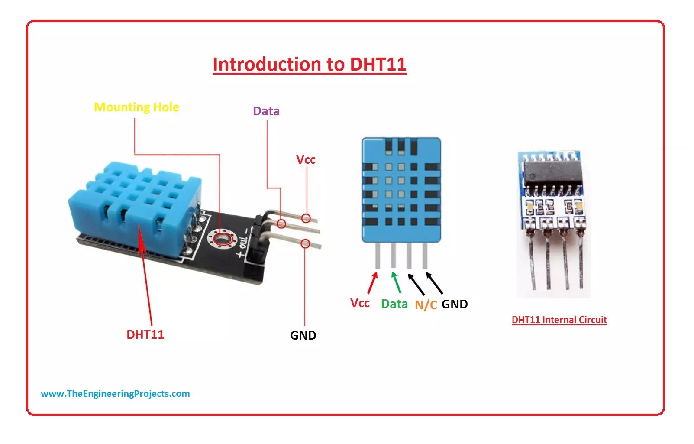

---

**ເຊັນເຊີວັດອຸນຫະພູມ LM35**

LM35 ແມ່ນເຊັນເຊີວັດອຸນຫະພູມແບບອະນາລອກທີ່ມີຄວາມແມ່ນຍໍາສູງ ແລະງ່າຍຕໍ່ການນໍາໃຊ້. ຄຸນສົມບັດພິເສດຂອງມັນຄື ມີເອົາພຸດສັນຍານເປັນເສັ້ນກົງ (Linear Output) ຢູ່ທີ່ 10 mV ຕໍ່ 1 ອົງສາເຊວຊຽດ (ເຊັ່ນ: ຖ້າວັດໄດ້ 25°C ຈະໄດ້ແຮງດັນປະມານ 250 mV). ເຊັນເຊີນີ້ສາມາດໃຊ້ກັບແຮງດັນ 4-30 ໂວລ, ກິນກະແສໄຟຟ້າໜ້ອຍຫຼາຍ ແລະບໍ່ຈໍາເປັນຕ້ອງມີການປັບຄ່າທີ່ສັບຊ້ອນເຊັ່ນເທີມິສເຕີ.

EX:  
**ລະບົບຄວບຄຸມພັດລົມອັດຕະໂນມັດ**
- ຖ້າ LM35 ວັດໄດ້ອຸນຫະພູມສູງກວ່າ 45°C
- Arduino ສົ່ງສັນຍານ PWM ໄປຫາທຣານຊິສເຕີທີ່ຄວບຄຸມພັດລົມ 5V
- ສະແດງອຸນຫະພູມທີ່ແນ່ນອນແບບເວລາຈິງໃນຈໍ 7-ເສັ້ນ 4 ຫຼັກ (TM1637)
- ປັບຄວາມໄວພັດລົມຕາມລະດັບອຸນຫະພູມ
 **ລະບົບຕິດຕາມອຸນຫະພູມມໍເຕີ/ແຜ່ນລະບາຍຄວາມຮ້ອນ**
- ຕິດ LM35 ດ້ວຍກາວອີພັອກຊີໃສ່ຕົວມໍເຕີຫຼືແຜ່ນລະບາຍຄວາມຮ້ອນ
- ຖ້າອຸນຫະພູມເພີ່ມຂຶ້ນໄວເກີນ 2°C ຕໍ່ນາທີ ຫຼື ເກີນ 70°C
- ລະບົບຈະຕັດໄຟຟ້າອັດຕະໂນມັດຜ່ານຣີເລເພື່ອປ້ອງກັນຄວາມເສຍຫາຍ
- ບັນທຶກເຫດການລົງໃນລະບົບເພື່ອການວິເຄາະຕໍ່ໄປ

**ຮູບພາບປະກອບ**

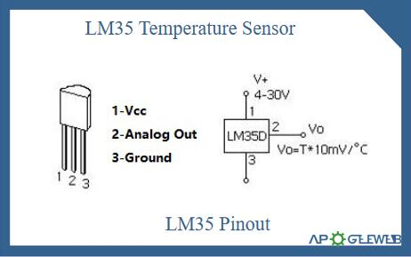

---

**ເຊັນເຊີວັດຄວາມອ່ຽງ (Tilt Sensor) x2**

ເຊັນເຊີວັດຄວາມອ່ຽງແມ່ນສະວິດອິເລັກໂຕຣນິກທີ່ກວດຈັບການປ່ຽນແປງທິດທາງ ຫຼືການຫັນເຫ. ພາຍໃນເຊັນເຊີປະກອບດ້ວຍລູກບານໂລຫະນ້ອຍໆ (ຫຼືໃນບາງແບບໃຊ້ປອດ mercury) ທີ່ຊອກກັນຢູ່ໃນຫຼອດ. ເມື່ອເຊັນເຊີຖືກຍ້າຍຫຼືອ່ຽງ, ລູກບານຈະມ້ວນໄປມາ ແລະເຮັດໃຫ້ຈຸດສໍາພັດໄຟຟ້າພາຍໃນເຊື່ອມຕໍ່ກັນ (ປິດວົງຈອນ) ຫຼື ແຍກອອກຈາກກັນ (ເປີດວົງຈອນ).

ເຊັນເຊີນີ້ໃຫ້ຜົນລັບແບບດິຈິຕອນເປັນ ON/OFF (HIGH/LOW) ທໍາມະດາ, ເຊິ່ງໝາຍຄວາມວ່າມັນບອກພຽງແຕ່ສະຖານະອ່ຽງຫຼື ບໍ່ອ່ຽງເທົ່ານັ້ນ, ບໍ່ແມ່ນລະດັບຄວາມອ່ຽງ. ເຊັນເຊີທີ່ມີ 2 ຕົວໃນຊຸດສາມາດໃຊ້ຕິດຕາມການອ່ຽງໃນ 2 ທິດທາງ ຫຼື ສໍາລັບການກວດຈັບການເຄື່ອນໄຫວທີ່ຫຼາກຫຼາຍຂຶ້ນ.

EX:  
**ລະບົບແຈ້ງເຕືອນການລັກ (Anti-theft Alarm)**
- ຕິດຕັ້ງເຊັນເຊີໃນຍານພາຫະນະ ຫຼືຕູ້ນິລະໄພ
- ເມື່ອມີຄົນຍົກ ຫຼືຍ້າຍວັດຖຸ, ເຊັນເຊີຈະກະຕຸ້ນສັນຍານ
- Arduino ຈະເປີດສຽງເຕືອນດັງ ແລະສົ່ງການແຈ້ງເຕືອນ
- ສາມາດເຊື່ອມຕໍ່ກັບໂມດູນ GSM ເພື່ອສົ່ງ SMS ແຈ້ງເຈົ້າຂອງ
ລະບົບດຸນຍະພາບຫຼອດ (Balance Robot)**
- ຫຼອດທີ່ດຸນຍະພາບດ້ວຍ 2 ລໍ້ຕ້ອງການກວດຈັບການເອຽງ
- ເຊັນເຊີ 2 ຕົວຕິດຕາມການເອຽງໜ້າ-ຫຼັງ ແລະ ຊ້າຍ-ຂວາ
- ເມື່ອຫຼອດເອຽງເກີນມຸມປອດໄພ, ລະບົບຈະປັບຄວາມໄວມໍເຕີທັນທີ
- ຊ່ວຍຮັກສາຄວາມສົມດຸນ ແລະປ້ອງກັນລົ້ມ

**ຮູບພາບປະກອບ**

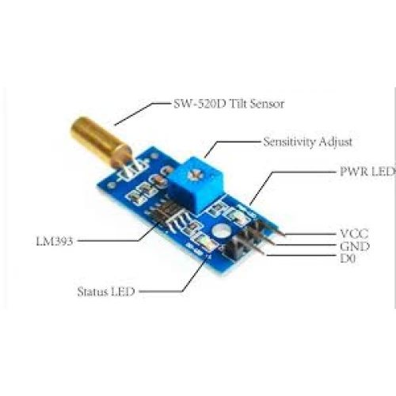

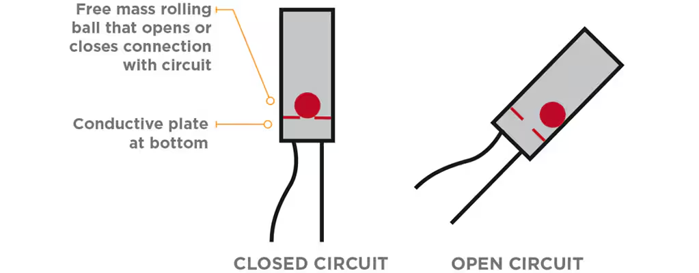

---

**ໂຟໂຕຣີຊິສເຕີ/LDR (Light Dependent Resistor) x3**

LDR (Light Dependent Resistor) ຫຼື Photoresistor ແມ່ນຕົວຕ້ານທານທີ່ມີຄ່າປ່ຽນແປງຕາມປະລິມານແສງສະຫວ່າງທີ່ຕົກກະທົບ. ຫຼັກການເຮັດວຽກແມ່ນເມື່ອມີແສງສະຫວ່າງຫຼາຍ, ຄວາມຕ້ານທານຈະຫຼຸດລົງ (ອານຸພາດກະແສໄຟຟ້າຜ່ານໄດ້ງ່າຍ); ໃນຄວາມມືດ, ຄວາມຕ້ານທານຈະເພີ່ມສູງຂຶ້ນຫຼາຍ (ບໍ່ຄ່ອຍໃຫ້ກະແສຜ່ານ).

ເພື່ອໃຊ້ງານກັບ Arduino, LDR ຈະຖືກຈັດວາງແບບ Voltage Divider Circuit (ວົງຈອນແບ່ງແຮງດັນ) ໂດຍຕໍ່ແບບອະນຸກົມກັບຕົວຕ້ານທານທີ່ມີຄ່າຄົງທີ່. Arduino ຈະອ່ານແຮງດັນທີ່ຈຸດກາງຜ່ານພິນອະນາລອກ (A0-A5) ແລະແປເປັນຄ່າຕົວເລກ 0-1023. ການມີ 3 ຕົວໃນຊຸດເຫມາະສໍາລັບໂຄງການທີ່ຕ້ອງການກວດຈັບແສງຫຼາຍຈຸດ ຫຼືສ້າງລະບົບຕິດຕາມແສງ.

EX: 

**ໂຄມໄຟກາງຄືນອັດຕະໂນມັດ**
- LDR ກວດຈັບລະດັບແສງສະຫວ່າງໃນຫ້ອງ
- ເມື່ອສະພາບແວດລ້ອມມືດລົງ (ຄ່າ LDR ສູງຂຶ້ນ)
- Arduino ຈະເປີດໂຄມໄຟ LED ຫຼືໄຟຫ້ອງອັດຕະໂນມັດ
- ປະຫຍັດພະລັງງານໂດຍເປີດເພາະເວລາຈໍາເປັນ
 **ລະບົບຕິດຕາມແສງແດດ (Solar Tracker)**
- ໃຊ້ LDR 3 ຕົວຕິດຕັ້ງໃນມຸມຕ່າງກັນບົນແຜງໂຊລາເຊວ
- ປຽບທຽບຄ່າແສງຈາກທັງ 3 ຈຸດ
- Arduino ຄວບຄຸມມໍເຕີເຊີໂວປັບມຸມແຜງໂຊລາເຊວໄປຫາທິດທາງທີ່ມີແສງແດດສູງສຸດ
- ເພີ່ມປະສິດທິພາບການຜະລິດພະລັງງານສູງສຸດເຖິງ 30-40%
 **ເຄື່ອງວັດລະດັບແສງສະຫວ່າງສະພາບແວດລ້ອມ**
- ໃຊ້ LDR ເກັບຂໍ້ມູນລະດັບແສງສະຫວ່າງໃນອາຄານອັດສະລິຍະ
- ສະແດງຜົນເປັນກຣາບໃນ Serial Monitor ຫຼື LCD
- ຄວບຄຸມໄຟໃນຫ້ອງໃຫ້ເໝາະສົມກັບແສງທໍາມະຊາດ (Adaptive Lighting)
- ນໍາໃຊ້ໃນໂຄງການປະຫຍັດພະລັງງານຂອງອາຄານສີຂຽວ

**ຮູບພາບປະກອບ**

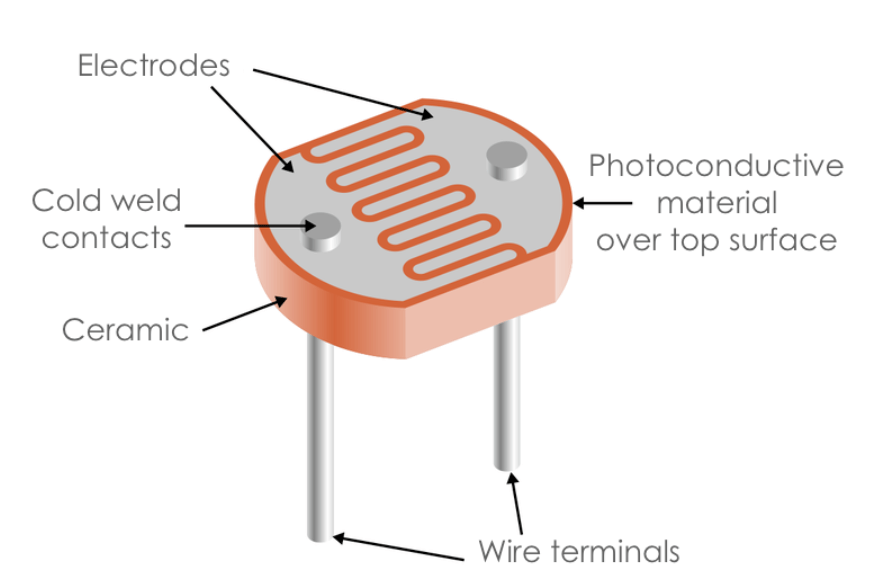

---

**ເຊັນເຊີ PIR**

ເຊັນເຊີ PIR ກວດຈັບການເຄື່ອນໄຫວໂດຍການວັດການປ່ຽນແປງຂອງລັງສີອິນຟຣາເຣດໃນສະພາບແວດລ້ອມ. ມັນໃຊ້ເຊັນເຊີ pyroelectric ແລະເລນ Fresnel ເພື່ອໂຟກັສສັນຍານ IR, ສົ່ງອອກສັນຍານ HIGH ເມື່ອກວດພົບການເຄື່ອນໄຫວ. ເຊັນເຊີເຮັດວຽກປົກກະຕິທີ່ 5V, ມີໄລຍະການກວດຈັບເຖິງ 7 ແມັດ. ມັນປະຫຍັດພະລັງງານ ແລະຕອບສະໜອງຕໍ່ການເຄື່ອນໄຫວຂອງຮ່າງກາຍທີ່ອົບອຸ່ນເທົ່ານັ້ນ (ມະນຸດ ຫຼື ສັດ).

EX: 
- **ລະບົບແສງສະຫວ່າງອັດຕະໂນມັດ**: ໄຟເປີດເມື່ອມີຄົນເຂົ້າຫ້ອງ
- **ສັນຍານເຕືອນຄວາມປອດໄພ**: ກະຕຸ້ນ buzzer ເມື່ອກວດພົບການເຄື່ອນໄຫວຕອນກາງຄືນ
- **ລະບົບບ້ານອັດສະລິຍະ**: ເປີດ AC ສະເພາະເມື່ອມີຄົນຢູ່ໃນຫ້ອງ

**ຮູບພາບປະກອບ**

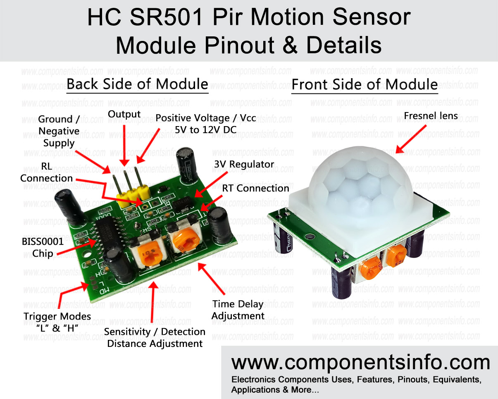

---

**ໂມດູນ Ultrasonic**

ເຊັນເຊີ ultrasonic ວັດໄລຍະທາງໂດຍການປ່ອຍຄື້ນສຽງ ultrasonic ແລະ ຄິດໄລ່ເວລາທີ່ພວກມັນໃຊ້ເພື່ອສະທ້ອນກັບຄືນຈາກສິ່ງກີດຂວາງ. ມັນໃຊ້ຄູ່ຕົວສົ່ງ ແລະ ຕົວຮັບ, ເຮັດວຽກກັບສູດຄວາມໄວຂອງສຽງເພື່ອຄິດໄລ່ໄລຍະທາງເປັນເຊັນຕິແມັດ. ໂມດູນມີໄລຍະປົກກະຕິ 2cm ຫາ 400cm ແລະເຮັດວຽກທີ່ 5V. ສັນຍານອອກຖືກປະມວນຜົນຜ່ານ digital pins ຂອງ Arduino ໂດຍໃຊ້ຟັງຊັນ pulseIn().

EX:
- **ຫຸ່ນຍົນອັດຕະໂນມັດ**: ຊ່ວຍກວດຈັບ ແລະ ຫຼີກລ່ຽງສິ່ງກີດຂວາງ
- **ລະບົບຊ່ວຍຈອດລົດ**: ແຈ້ງເຕືອນເມື່ອຍານພາຫະນະເຂົ້າໃກ້ຝາເກີນໄປ
- **ຕົວກວດລະດັບນ້ຳ**: ວັດຄວາມເລິກຂອງນ້ຳໃນຖັງ

**ຮູບພາບປະກອບ**

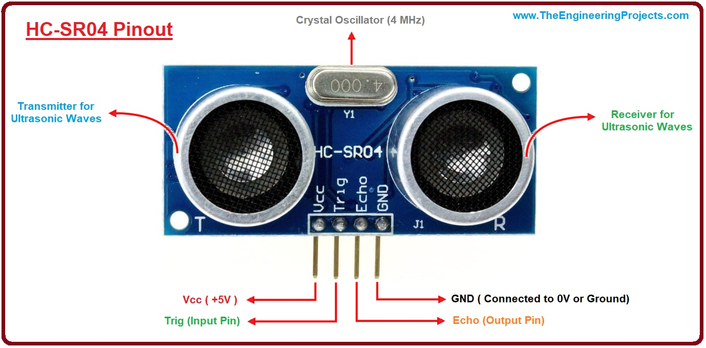

---

 **ເຊັນເຊີສຽງ (Sound Sensor)**

 ເຊັນເຊີສຽງໃຊ້ໄມໂຄໂຟນ ແລະ ວົງຈອນຂະຫຍາຍເພື່ອກວດຈັບລະດັບສຽງລົບກວນ. ມັນປ່ຽນຄວາມດັນສຽງເປັນສັນຍານໄຟຟ້າ, ສົ່ງອອກທັງແບບແອນາລັອກ (ຄວາມເຂັ້ມຂອງສຽງ) ຫຼື ແບບດິຈິຕອລ (ເກີນຄ່າກຳນົດສຽງ). Arduino ສາມາດໃຊ້ມັນເພື່ອກວດຈັບການຕົບມື ຫຼື ການກະຕຸ້ນດ້ວຍສຽງ.

EX: 
- **ໂຄງການສະວິດຕົບມື**: ເປີດ/ປິດໄຟດ້ວຍການຕົບມື
- **ຫຸ່ນຍົນທີ່ກະຕຸ້ນດ້ວຍສຽງ**: ມໍເຕີເຄື່ອນທີ່ຕາມສຽງດັງ
- **ຕົວຕິດຕາມສິ່ງແວດລ້ອມ**: ວັດມົນລະພິດທາງສຽງໃນສະພາບແວດລ້ອມ

**ຮູບພາບປະກອບ**

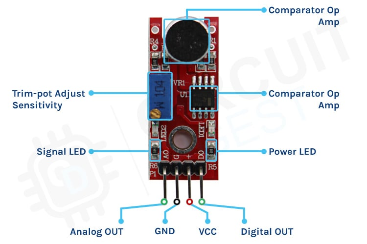

---

**ເຊັນເຊີນ້ຳ (Water Sensor)**

ເຊັນເຊີນ້ຳກວດຈັບການມີຢູ່ ຫຼື ລະດັບຂອງນ້ຳຜ່ານຮ່ອງນຳໄຟຟ້າທີ່ຂະໜານກັນທີ່ປ່ຽນຄວາມຕ້ານທານເມື່ອປຽກ. ມັນສົ່ງອອກຄ່າແອນາລັອກທີ່ສອດຄ່ອງກັບລະດັບຄວາມຊຸ່ມ. ໂມດູນຖືກນຳໃຊ້ໃນສັນຍານເຕືອນນ້ຳຖ້ວມ ແລະ ລະບົບຊົນລະປະທານອັດຕະໂນມັດ.

EX: 
- **ກວດຈັບການຮົ່ວໄຫຼ**: ໃນຫ້ອງນ້ຳ ຫຼື ຫ້ອງຄົວເພື່ອກະຕຸ້ນສັນຍານເຕືອນ
- **ລະບົບຫົດນ້ຳອັດຕະໂນມັດ**: ຕິດຕາມຄວາມຊຸ່ມຂອງດິນເພື່ອປ້ອງກັນການຫົດນ້ຳເກີນ
- **ລະບົບຄວບຄຸມລະດັບນ້ຳ**: ເປີດ/ປິດປັ໊ມນ້ຳອັດຕະໂນມັດ

**ຮູບພາບປະກອບ**

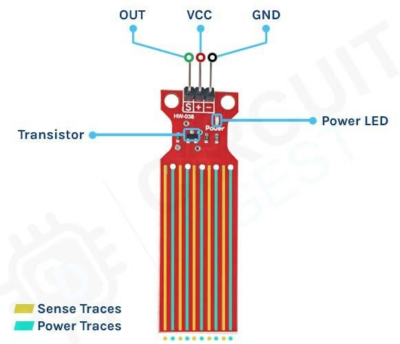

---

**ເຊັນເຊີແປວໄຟ (Flame Sensor)**

ເຊັນເຊີແປວໄຟກວດຈັບແສງອິນຟຣາເຣດທີ່ປ່ອຍອອກມາຈາກແປວໄຟ, ໂດຍປົກກະຕິປະມານຄວາມຍາວຄື້ນ 760-1100nm. ມັນສົ່ງອອກສັນຍານດິຈິຕອລ ຫຼື ແອນາລັອກໂດຍອີງຕາມຄວາມໃກ້ຂອງແປວໄຟ. ເຊັນເຊີເຮັດວຽກໄດ້ດີທີ່ສຸດພາຍໃນຕຶກ, ຍ້ອນວ່າແສງຕາເວັນສາມາດເຮັດໃຫ້ເກີດການອ່ານຄ່າທີ່ຜິດພາດ.

EX: 
- **ລະບົບກວດຈັບໄຟໄໝ້**: ກະຕຸ້ນ buzzer ຫຼື ນ້ຳພົດພູ່ນເມື່ອກວດພົບໄຟ
- **ເຕົາແກ໊ສ**: ກົນໄກຄວາມປອດໄພອັດຕະໂນມັດເມື່ອແປວໄຟດັບ
- **ຫຸ່ນຍົນດັບເພີງ**: ເຄື່ອນທີ່ໄປຫາແຫຼ່ງແປວໄຟ

**ຮູບພາບປະກອບ**

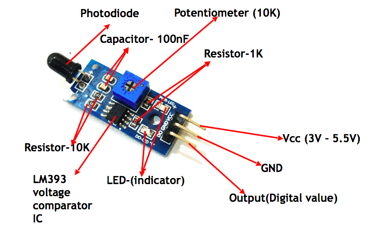

---

**ໂມດູນ RFID**

ໂມດູນ RFID (Radio Frequency Identification) ອ່ານ ແລະ ຂຽນຂໍ້ມູນໄປຫາບັດ RFID ຫຼື ແທັກຜ່ານຄື້ນວິທະຍຸ. RC522 ເຮັດວຽກທີ່ຄວາມຖີ່ 13.56MHz, ສື່ສານຜ່ານ protocol SPI, ແລະມີໄລຍະກວດຈັບປະມານ 5cm. ມັນຖືກໃຊ້ສຳລັບການກຳນົດຕົວຕົນແບບບໍ່ຕ້ອງສຳພັດ ແລະ ການຄວບຄຸມການເຂົ້າເຖິງ.

EX: 
- **ລະບົບລັອກປະຕູ**: ອະນຸຍາດການເຂົ້າເຖິງເມື່ອແຕະບັດທີ່ລົງທະບຽນແລ້ວ
- **ລະບົບເຂົ້າຮ່ວມ**: ບັນທຶກຜູ້ໃຊ້ໂດຍການສະແກນແທັກ ID ຂອງພວກເຂົາ
- **ການຄຸ້ມຄອງສິນຄ້າຄົງຄັງ**: ຕິດຕາມສິນຄ້າທີ່ມີແທັກຢ່າງອັດຕະໂນມັດ

**ຮູບພາບປະກອບ**

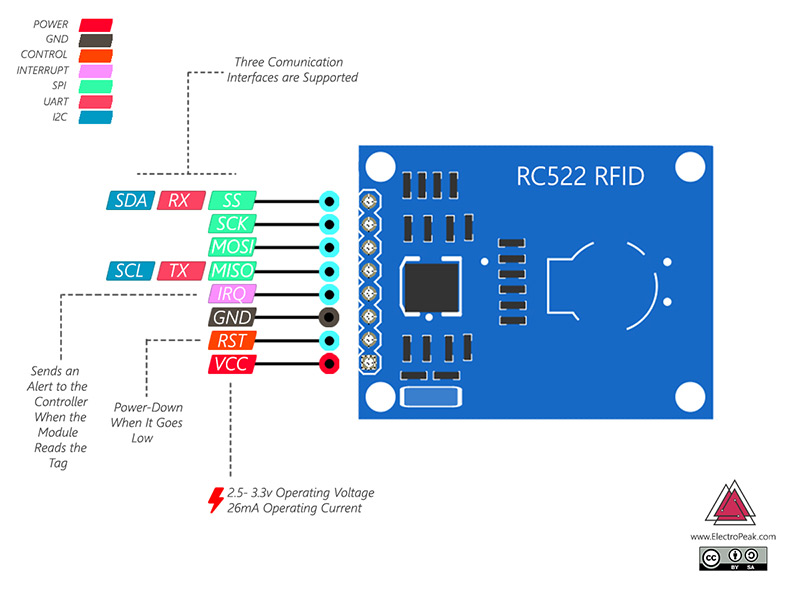

---

**ແທັກ RFID (RFID Tag)**

ແທັກ RFID ປະກອບມີໄມໂຄຊິບ ແລະ ເສົາອາກາດທີ່ເກັບຮັກສາເລກກຳນົດຕົວຕົນທີ່ເປັນເອກະລັກ. ເມື່ອນຳເຂົ້າໃກ້ຕົວອ່ານ RFID, ມັນສົ່ງຂໍ້ມູນຜ່ານຊັກນຳໄຟຟ້າແມ່ເຫຼັກ. ແທັກສາມາດເປັນແບບ passive (ບໍ່ມີແຫຼ່ງພະລັງງານ) ຫຼື active (ມີແບັດເຕີຣີ).

EX: **:** 
- ໃຊ້ໃນບັດປະຈຳຕົວພະນັກງານສຳລັບເຂົ້າອາຄານຢ່າງປອດໄພ
- ຕິດກັບໜັງສືຫ້ອງສະໝຸດສຳລັບລະບົບເຊັກອິນ-ເຊັກເອົາອັດຕະໂນມັດ
- ຝັງຢູ່ໃນບັດສະມາດສຳລັບການຈ່ າຍເງິນ ຫຼື ການກວດສອບຕົວຕົນ

**ຮູບພາບປະກອບ**

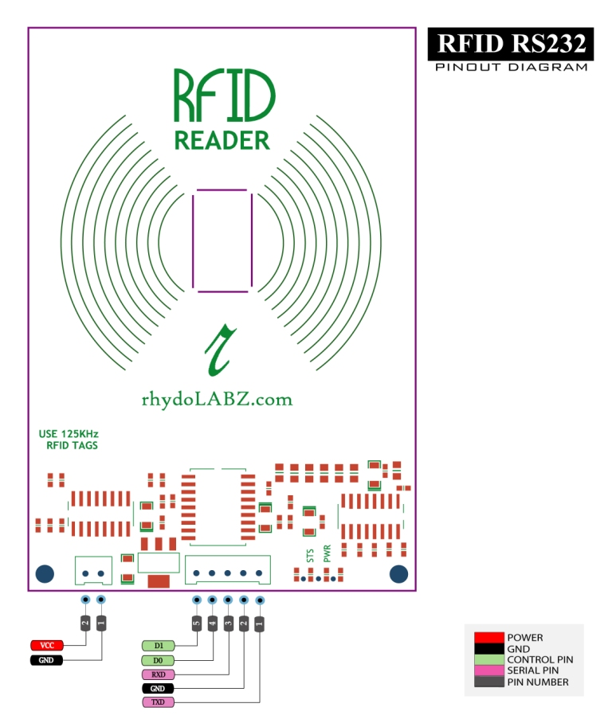

---

**Infrared receiver**

ເຄື່ອງຮັບ IR ກວດຈັບ ແລະ ຖອດລະຫັດສັນຍານທີ່ສົ່ງໂດຍລີໂມດອິນຟາເຣດ. ມັນກັ່ນຕອງຄວາມຖີ່ສັນຍານພາຫະທີ່ປັບ 38 kHz ແລະ ສົ່ງລະຫັດດິຈິຕອນໄປໃຫ້ Arduino. ແຕ່ລະປຸ່ມໃນລີໂມດຈະສົ່ງລະຫັດເລກຖານສິບຫົກທີ່ເປັນເອກະລັກ, ເຊິ່ງສາມາດແມັບກັບຟັງຊັນສະເພາະໄດ້.

EX: 
- ຄວບຄຸມການເຄື່ອນໄຫວຂອງຫຸ່ນຍົນຜ່ານການປ້ອນຂໍ້ມູນຈາກລີໂມດ IR
- ປະຕິບັດງານອຸປະກອນສະມາດ, ເຊັ່ນ: ປິດໄຟ ຫຼື ຄວບຄຸມພັດລົມ
- ນຳທາງເມນູຫຼາຍໂໝດໃນຈໍ LCD ຜ່ານຄຳສັ່ງຈາກລີໂມດ

**ຮູບພາບປະກອບ**

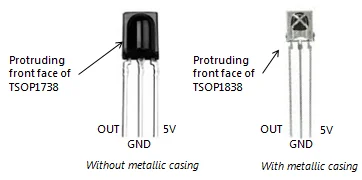

________________________________________________________________________
# **🎮 Remote & Control**

 **ລີໂມດຄວບຄຸມແບບອິນຟຣາເຣດ**

 ລີໂມດຄວບຄຸມແບບອິນຟຣາເຣດ (IR) ສົ່ງສັນຍານທີ່ມີລະຫັດເປັນກະແສແສງອິນຟຣາເຣດໄປຫາໂມດູນຮັບສັນຍານ. ມັນເຮັດວຽກໂດຍປົກກະຕິປະມານຄວາມຖີ່ 38 kHz, ທີ່ແຕ່ລະປຸ່ມມີຮູບແບບລະຫັດດິຈິຕອລທີ່ເປັນເອກະລັກ. Arduino ອ່ານຮູບແບບນີ້ຜ່ານເຊັນເຊີຮັບສັນຍານ IR (ເຊັ່ນ VS1838B) ໂດຍໃຊ້ library IRremote. ການຕັ້ງຄ່ານີ້ເຮັດໃຫ້ມີການສື່ສານໄຮ້ສາຍລະຫວ່າງຜູ້ໃຊ້ ແລະ ໂຄງການຂອງພວກເຂົາ.

EX: 
- ໃຊ້ເພື່ອຄວບຄຸມເມນູແບບທີວີຢູ່ໃນຈໍ LCD 16×2 ເພື່ອເລືອກໂໝດຕ່າງໆໃນລະບົບອັດຕະໂນມັດໜ້າບ້ານ
- ປະຕິບັດເພື່ອເປີດ/ປິດໄຟ ຫຼື ພັດລົມຈາກໄກໃນການຕັ້ງຄ່າຫ້ອງອັດສະລິຍະ
- ໃນລົດຫຸ່ນຍົນ, ລີໂມດຖືກໃຊ້ເພື່ອສັ່ງການເຄື່ອນທີ່ເຊັ່ນ: ໄປຂ້າງໜ້າ, ຖອຍຫຼັງ, ແລະ ຢຸດ

**ຮູບພາບປະກອບ**

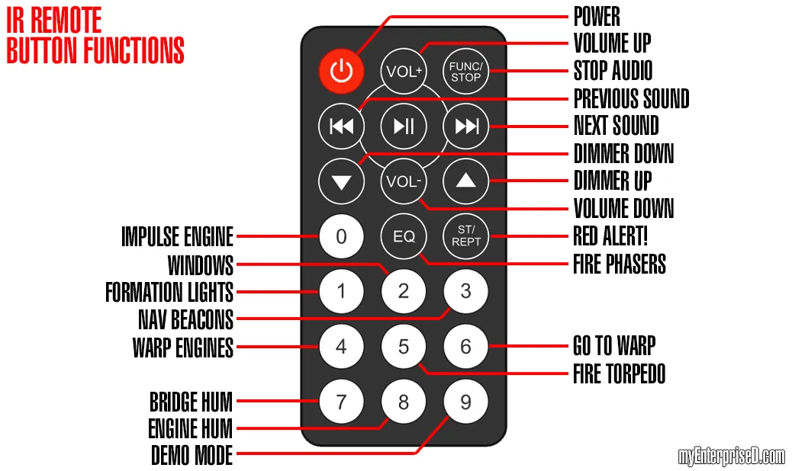

________________________________________________________________________
**ໂມດູນຈອຍສະຕິກ**

ໂມດູນຈອຍສະຕິກໃຫ້ການຄວບຄຸມແບບແອນາລັອກສອງແກນ (X ແລະ Y) ແລະ ປຸ່ມກົດດິຈິຕອລນຶ່ງປຸ່ມ. ແຕ່ລະແກນໃຊ້ໂພເທນຊີໂອມິເຕີເພື່ອປ່ຽນແປງຄວາມຕ້ານທານ, ປ່ຽນການເຄື່ອນໄຫວທາງກາຍະພາບເປັນຄ່າແຮງດັນ (0–1023). ຂໍ້ມູນນີ້ຖືກອ່ານໂດຍ analog pins ຂອງ Arduino ເພື່ອການຄວບຄຸມທິດທາງທີ່ແນ່ນອນ.

EX: 
- ໃຊ້ໃນຍານພາຫະນະຫຸ່ນຍົນເພື່ອຄວບຄຸມທິດທາງ ແລະ ຄວາມໄວດ້ວຍມື
- ໃນກິມບອນກ້ອງຖ່າຍຮູບ, ຈອຍສະຕິກເຄື່ອນກ້ອງໄປແນວນອນ ຫຼື ແນວຕັ້ງ
- ເຮັດໜ້າທີ່ເປັນການປ້ອນຂໍ້ມູນຕົວຄວບຄຸມເກມສຳລັບເຄື່ອງເກມທີ່ໃຊ້ Arduino

**ຮູບພາບປະກອບ**

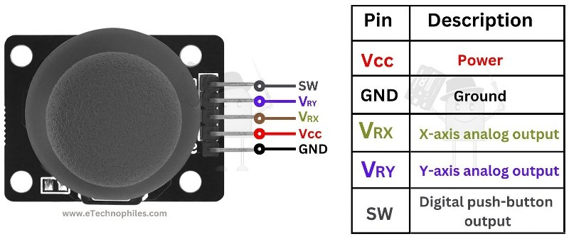

________________________________________________________________________
**ໂມດູນແປ້ນພິມແບບ Matrix 4×4**

ແປ້ນພິມແບບ matrix 4×4 ປະກອບດ້ວຍປຸ່ມກົດ 16 ປຸ່ມທີ່ຈັດວາງເປັນຕາຕະລາງ (4 แຖວ × 4 ຖັນ). ມັນໃຊ້ເຕັກນິກການສະແກນເພື່ອກວດຫາວ່າປຸ່ມໃດຖືກກົດ, ຫຼຸດຜ່ອນການໃຊ້ pin (ໃຊ້ພຽງ 8 Arduino pins ສຳລັບ 16 ປຸ່ມ). ມັນຖືກນຳໃຊ້ທົ່ວໄປສຳລັບການປ້ອນຂໍ້ມູນ ຫຼື ການປ້ອນລະຫັດຜ່ານ.

EX:
- ສ້າງລະບົບລັອກດິຈິຕອລ, ທີ່ຜູ້ໃຊ້ຕ້ອງປ້ອນ PIN ເພື່ອເປີດໃຊ້ງານ relay ຫຼື servo
- ໃຊ້ໃນການນຳທາງເມນູ, ອະນຸຍາດໃຫ້ເລືອກລະຫວ່າງໂໝດຕ່າງໆຢູ່ໃນ LCD
- ໃນເຄື່ອງຄິດເລກແບບ embedded, ແຕ່ລະປຸ່ມເປັນຕົວເລກ ຫຼື ການດຳເນີນງານ

**ຮູບພາບປະກອບ**

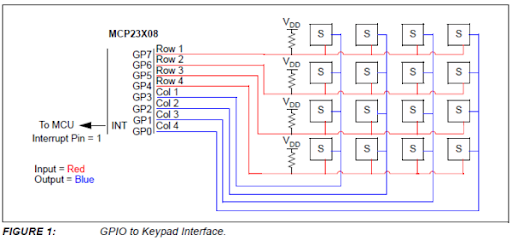

---

**ໂມດູນ Relay**

ໂມດູນ relay ເຮັດໜ້າທີ່ເປັນສະວິດທີ່ຄວບຄຸມດ້ວຍໄຟຟ້າ, ອະນຸຍາດໃຫ້ສັນຍານພະລັງງານຕ່ຳ (ຈາກ Arduino) ຄວບຄຸມໂຫຼດພະລັງງານສູງເຊັ່ນ: ໄຟ ຫຼື ມໍເຕີ. ມັນໃຊ້ຂົດລວດແມ່ເຫຼັກໄຟຟ້າທີ່ສະຫຼັບຈຸດຕິດຕໍ່ທາງກົນຈັກເມື່ອໄດ້ຮັບພະລັງງານ. Relay ມີທັງແບບຊ່ອງດຽວ ແລະ ຫຼາຍຊ່ອງພ້ອມ driver transistor ແລະ protection diode ທີ່ຕິດຕັ້ງໄວ້.

EX: 
- ຄວບຄຸມເຄື່ອງໃຊ້ໃນເຮືອນແບບ AC ເຊັ່ນ: ໂຄມໄຟ ຫຼື ພັດລົມໂດຍໃຊ້ສັນຍານອອກຂອງ Arduino
- ໃຊ້ໃນລະບົບຊົນລະປະທານອັດສະລິຍະເພື່ອຄວບຄຸມປັ້ມນ້ຳອັດຕະໂນມັດ
- ໃນລະບົບຄວາມປອດໄພ, relay ຕັດການເຊື່ອມຕໍ່ວົງຈອນພະລັງງານສູງເມື່ອກວດພົບເງື່ອນໄຂຜິດປົກກະຕິ

**ຮູບພາບປະກອບ**

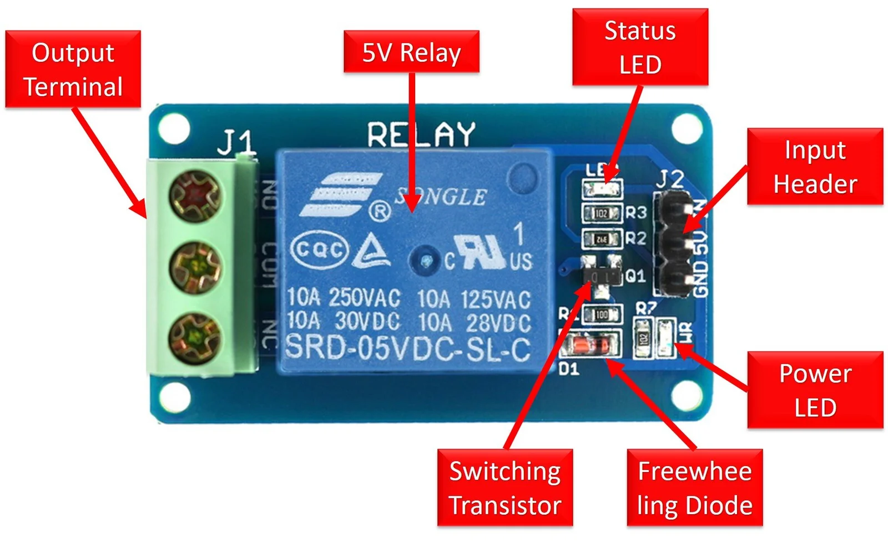

________________________________________________________________________
# **⚙️ Motors & Drivers**

**ມໍເຕີ Servo**

ມໍເຕີ servo ແມ່ນຕົວສະແດງການໝຸນທີ່ອະນຸຍາດໃຫ້ຄວບຄຸມຕຳແໜ່ງມຸມຢ່າງແນ່ນອນ. ມັນປະກອບດ້ວຍມໍເຕີ DC, ໂພເທນຊີໂອມິເຕີແບບ feedback, ແລະ ວົງຈອນຄວບຄຸມ. ຕຳແໜ່ງຖືກປັບດ້ວຍການໃຊ້ Pulse Width Modulation (PWM), ທີ່ຄວາມຍາວຂອງ pulse ກຳນົດມຸມການໝຸນ (ປົກກະຕິ 0°–180°). ແຮງດັນການເຮັດວຽກຢູ່ລະຫວ່າງ 4.8V ຫາ 6V.

EX: 
- ໃຊ້ສຳລັບແຂນຫຸ່ນຍົນເພື່ອເຄື່ອນຂໍ້ຕໍ່ ຫຼື ຈັບວັດຖຸຢ່າງແນ່ນອນ
- ເຮັດໜ້າທີ່ເປັນຕົວຄວບຄຸມການຫັກລ້ຽວໃນລົດອັດຕະໂນມັດຂະໜາດນ້ອຍ
- ດຳເນີນການເປັນ actuator ລັອກປະຕູໃນລະບົບເຂົ້າເຖິງທີ່ໃຊ້ RFID

**ຮູບພາບປະກອບ**

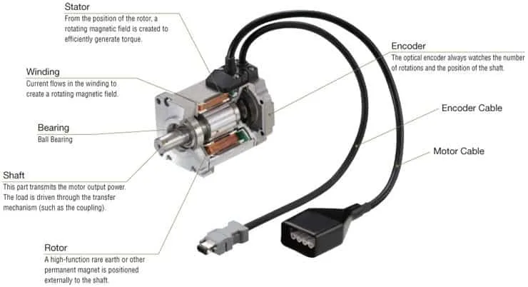

---

**ມໍເຕີ Stepper**

ມໍເຕີ stepper ແບ່ງການໝຸນເຕັມອອກເປັນມຸມຂັ້ນຕອນທີ່ເທົ່າກັນ (ເຊັ່ນ: 1.8° ຕໍ່ຂັ້ນຕອນ). ມັນເຄື່ອນທີ່ແບບເພີ່ມທີລະໜ້ອຍເມື່ອມີ pulse ໄຟຟ້າຖືກນຳໄປໃຊ້ກັບຂົດລວດຂອງມັນຕາມລຳດັບ. ມໍເຕີ stepper ໃຫ້ການຄວບຄຸມຕຳແໜ່ງທີ່ແນ່ນອນໂດຍບໍ່ມີ feedback, ເຮັດໃຫ້ເໝາະສົມສຳລັບລະບົບ open-loop. ພວກມັນຕ້ອງການວົງຈອນ driver ທີ່ອຸທິດຕົນເພື່ອຈັດການກະແສ ແລະ ລຳດັບການກ້າວ.

EX: 
- ຄວບຄຸມການເຄື່ອນທີ່ຂອງເຄື່ອງພິມ 3D ຫຼື ແກນຂອງເຄື່ອງ CNC
- ດຳເນີນການຂອບການສະແດງທີ່ໝຸນໃນການຕັ້ງຄ່າໂຄສະນາ
- ປັບມຸມຂອງແຜງໂຊລາເຊວເພື່ອຕິດຕາມແສງຕາເວັນອັດຕະໂນມັດ

**ຮູບພາບປະກອບ**

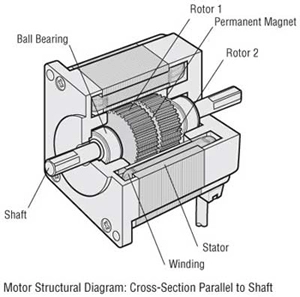

---
 
**ບອດຄວບຄຸມມໍເຕີ Stepper**

ຕົວຄວບຄຸມມໍເຕີ stepper (ເຊັ່ນ: ULN2003, A4988, ຫຼື L298N) ຄວບຄຸມຂັ້ນຕອນຂອງມໍເຕີໃນລຳດັບທີ່ຖືກຕ້ອງ ແລະ ໃຫ້ກະແສທີ່ພຽງພໍ. ມັນແປສັນຍານລະດັບຕັກກະຂອງ Arduino ເປັນລະດັບພະລັງງານທີ່ຕ້ອງການສຳລັບຂົດລວດມໍເຕີ. Driver ບາງຕົວຮອງຮັບ micro-stepping ສຳລັບການເຄື່ອນໄຫວທີ່ລຽບ ແລະ ຄວາມແນ່ນອນທີ່ດີຂຶ້ນ.

EX: 
- ໃຊ້ driver ULN2003 ກັບມໍເຕີ stepper 28BYJ-48 ສຳລັບໂຄງການຫຸ່ນຍົນ
- ນຳໃຊ້ driver A4988 ໃນລະບົບ CNC ສຳລັບການຄວບຄຸມແຮງບິດສູງ
- ລວມບອດ driver L298N ໃນຫຸ່ນຍົນອັດຕະໂນມັດຂະໜາດນ້ອຍເພື່ອຈັດການລໍ້ທັງສອງຢ່າງເປັນເອກະລາດ

**ຮູບພາບປະກອບ**

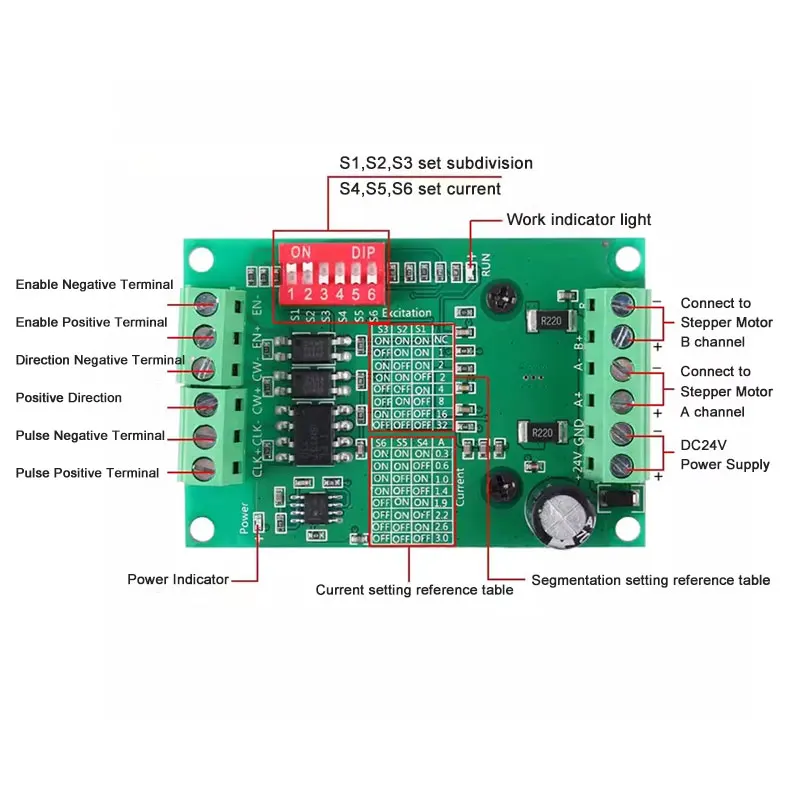

________________________________________________________________________
# **🧠 ICs & Modules**

**ໂມດູນນາລິກາເວລາຈິງ (DS1302 Real-Time Clock Module)**

ໂມດູນ DS1302 RTC ແມ່ນອຸປະກອນຈັບເວລາທີ່ຕິດຕາມວິນາທີ, ນາທີ, ຊົ່ວໂມງ, ມື້, ເດືອນ, ແລະ ປີ ເຖິງແມ່ນວ່າລະບົບຫຼັກຈະປິດພະລັງງານກໍຕາມ. ມັນໃຊ້ Trickle-Charge Timekeeping Chip ທີ່ໄດ້ຮັບພະລັງງານຈາກແບັດເຕີຣີແບບເຫຼັກກະປ໋ອງຂະໜາດນ້ອຍ (ປົກກະຕິແມ່ນ CR2032) ເພື່ອຮັກສາເວລາທີ່ຖືກຕ້ອງເປັນເວລາຫຼາຍປີ.

DS1302 ສື່ສານກັບ Arduino ຜ່ານອິນເຕີເຟສແບບ serial (3-wire: I/O, SCLK, CE). ນອກຈາກນີ້ມັນຍັງມີ RAM ແບບ non-volatile 31 bytes ທີ່ສາມາດເກັບຂໍ້ມູນຂະໜາດນ້ອຍເຊັ່ນ: ການຕັ້ງຄ່າສັນຍານເຕືອນ ຫຼື offset ການປັບຄາລິເບຣດ.

EX: 
- **ໂຄງການໂມງດິຈິຕອນ**: DS1302 ໃຫ້ການອັບເດດເວລາຈິງສຳລັບຈໍສະແດງ 7-segment 4 ຫຼັກ ຫຼື LCD
- **ເຄື່ອງບັນທຶກຂໍ້ມູນ (Data Logger)**: ໃຊ້ໃນລະບົບບັນທຶກຂໍ້ມູນທີ່ມີ timestamp (ເຊັ່ນ: ອຸນຫະພູມ, ຄວາມຊຸ່ມ) ທີ່ຖືກບັນທຶກລົງ SD card
- **ລະບົບອັດຕະໂນມັດ**: RTC ກະຕຸ້ນເຫດການທີ່ອີງໃສ່ເວລາ ເຊັ່ນ: ເປີດໄຟຕອນຕອນແລງ ຫຼື ເປີດລະບົບຊົນລະປະທານຕອນເຊົ້າ

**ຮູບພາບປະກອບ**

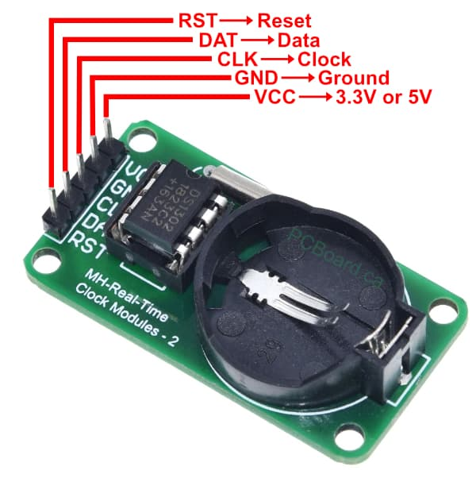

---

**ຊິບ Shift Register 74HC595**

74HC595 ແມ່ນ shift register ແບບ 8-bit serial-in, parallel-out ທີ່ຂະຫຍາຍຈຳນວນ output pins ທີ່ມີຈາກໄມໂຄຣຄອນໂທຣເລີ. ມັນເຮັດວຽກໂດຍການຮັບຂໍ້ມູນແບບ serial ຈາກ Arduino (ຜ່ານສາມ pins: Data, Clock, ແລະ Latch) ແລະ ຫຼັງຈາກນັ້ນຈຶ່ງເລື່ອນ bits ອອກມາເພື່ອຄວບຄຸມຫຼາຍ outputs ພ້ອມກັນ.

ແຕ່ລະຊິບສາມາດເຊື່ອມຕໍ່ແບບ daisy-chain ໄດ້, ອະນຸຍາດໃຫ້ຄວບຄຸມ 16, 24, ຫຼືເຖິງແມ່ນ 64 outputs ໂດຍໃຊ້ພຽງແຕ່ສອງສາມ Arduino pins. ນີ້ເຮັດໃຫ້ມັນເໝາະສົມສຳລັບການຄວບຄຸມຊຸດ LED ຂະໜາດໃຫຍ່ ຫຼື ຈໍສະແດງຫຼາຍ segment ຢ່າງມີປະສິດທິພາບ.

EX: 
- **ຄວບຄຸມ LED Matrix 8x8**: ແຕ່ລະ output line ຄວບຄຸມຫນຶ່ງຖັນຂອງ LED
- **ຈໍສະແດງ 7-Segment ຫຼາຍໂຕ**: ດຳເນີນການຈໍສະແດງຕົວເລກຫຼາຍໆໂຕ (ເຊັ່ນ: ກະດານຄະແນນ ຫຼື ຕົວນັບ)
- **ແຜງຄວບຄຸມອຸດສາຫະກຳ**: ຄວບຄຸມ LED ຕົວບອກສະຖານະໃນແຜງຄວບຄຸມ ຫຼື ຕົວບອກຊັ້ນລິຟ

**ຮູບພາບປະກອບ**

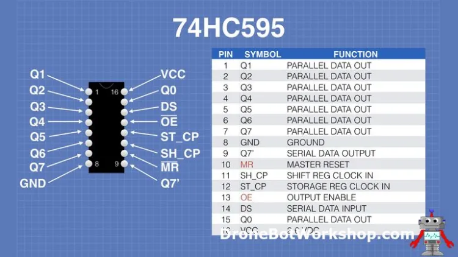

